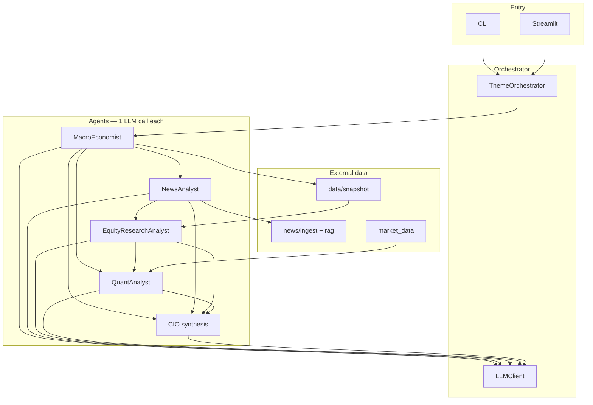

# Investment Agent — Multi-Agent Theme Analysis

Four specialist agents plus a CIO layer output **investable themes** with lifecycle stage: **Early / Early-Mid / Mid / Mid-Late / Late**.

| Agent | Role | Focus |
|-------|------|--------|
| **Agent 1** | Macro Economist | Rates, inflation, policy, geopolitics, cross-asset signals |
| **Agent 2** | News / RAG Analyst | Retrieved headlines (Finnhub + TickerTick), cited drivers/risks |
| **Agent 3** | Equity Research Analyst | Valuations, earnings revisions; macro + news + yfinance fundamentals |
| **Agent 4** | Quant Analyst | Volatility, VIX, sector realized vol, risk timing |

A CIO synthesis layer merges views into final stage, consensus, and investability scores. **All prompts and outputs are in English.**

## Stage definitions

| Stage | Code | Meaning |
|-------|------|---------|
| Early | `early` | Theme forming, not fully priced — positioning |
| Early-Mid | `early_mid` | Thesis validating, narrative spreading |
| Mid | `mid` | Trend confirmed, earnings and flows supporting |
| Mid-Late | `mid_late` | Crowded, rich valuations, vol rising |
| Late | `late` | Overheated — exit watch |

## Quick start

```bash
cd investment_agent
python -m venv .venv
source .venv/bin/activate
pip install -e .

cp .env.example .env
# Set GEMINI_API_KEY or OPENAI_API_KEY in .env
```

### Gemini

1. Create an API key at [Google AI Studio](https://aistudio.google.com/apikey)
2. In `.env`:

```bash
LLM_PROVIDER=gemini
GEMINI_API_KEY=your-key
GEMINI_MODEL=gemini-2.5-flash-lite
```

Run:

```bash
python main.py
invest-themes

python main.py --json
python main.py --region US
python main.py -o reports/latest.json
```

### Streamlit dashboard

```bash
streamlit run streamlit_app.py
# or
invest-dashboard
```

1. Select market region, click **Run analysis**
2. Or **Load last result** for `reports/latest.json`

## Environment variables

| Variable | Description |
|----------|-------------|
| `GEMINI_API_KEY` | Gemini key (with `LLM_PROVIDER=gemini`) |
| `GEMINI_MODEL` | Default `gemini-2.5-flash-lite` |
| `LLM_PROVIDER` | `gemini` or `openai` |
| `OPENAI_API_KEY` | OpenAI or compatible API key |
| `MARKET_REGION` | `global`, `US`, `China`, etc. |
| `FINNHUB_API_KEY` | Optional; more news via [Finnhub](https://finnhub.io/) |
| `NEWS_MAX_ARTICLES` | Max headlines to ingest (default `40`) |
| `RAG_TOP_K` | Articles passed to News Agent after retrieval (default `12`) |
| `FUNDAMENTALS_MAX_TICKERS` | Max theme tickers for yfinance fundamentals (default `8`) |
| `RESUME_CHECKPOINT` | Save agent outputs under `reports/cache/` for resume (default `1`) |
| `LLM_MAX_RETRIES_ON_429` | Short rate-limit retries in `llm.py` (default `2`) |

## Architecture

Multi-agent **investment theme research** prototype: four specialist agents plus a CIO synthesis layer, orchestrated in Python (no separate workflow engine). Outputs are structured JSON (`InvestmentBrief`) and optional Streamlit/CLI views.

### System layers

```
┌─────────────────────────────────────────────────────────────┐
│  Entry: main.py / cli.py  ·  streamlit_app.py                │
└────────────────────────────┬────────────────────────────────┘
                             ▼
┌─────────────────────────────────────────────────────────────┐
│  ThemeOrchestrator (orchestrator.py)                        │
│  · Settings (.env)  · LLMClient (Gemini/OpenAI JSON)        │
│  · Checkpoint resume (reports/cache/)  · storage (latest.json)│
└────────────────────────────┬────────────────────────────────┘
                             ▼
┌──────────────┬──────────────┬──────────────┬────────────────┐
│ Agent 1      │ Agent 2      │ Agent 3      │ Agent 4        │
│ Macro        │ News + RAG   │ Equity       │ Quant          │
│ (LLM)        │ (ingest+RAG  │ (LLM +       │ (LLM +         │
│              │  + LLM)      │  structured) │  yfinance vol) │
└──────────────┴──────────────┴──────────────┴────────────────┘
                             ▼
                    CIO synthesis (LLM)
                             ▼
                    InvestmentBrief + _enrich_brief()
```

| Layer | Components | Role |
|-------|------------|------|
| **Entry** | `main.py`, `cli.py`, `streamlit_app.py` | Run analysis, load cache, display UI |
| **Orchestration** | `ThemeOrchestrator`, `checkpoint.py` | Sequential pipeline, resume on 429 |
| **Agents** | `agents/*.py` | One structured LLM call each (+ shared `LLMClient`) |
| **Data (non-LLM)** | `news/`, `data/`, `market_data.py` | Ingest, RAG, fundamentals, volatility |
| **Core** | `models.py`, `llm.py`, `config.py`, `dates.py`, `storage.py` | Schemas, API, env, persistence |

### Runtime pipeline

Entry points call `ThemeOrchestrator.run()` in `src/investment_agent/orchestrator.py`. A full run uses **~5 LLM requests** (macro → news → equity → quant → CIO).

**Independent theme lists** (branch `feature/independent-agent-themes`): each agent proposes its own `themes[]`; the CIO merges by concept (`contributing_agents`, sparse `agent_stages`). News no longer receives the macro theme list; equity receives only news backdrop (not news themes); quant uses vol data only.

```
fetch_vol_snapshot()                         [yfinance — no LLM]
MacroEconomist.analyze()                     [LLM → MacroReport + themes]
fetch_news_articles() + lexical RAG          [region query — no macro theme names]
NewsAnalyst.analyze()                        [LLM → NewsReport + own themes]
fetch_fundamentals_snapshot([])              [sector ETFs + SPY only]
EquityResearchAnalyst.analyze(news, ...)     [LLM → EquityReport + own themes]
QuantAnalyst.analyze(vol, regime hint)       [LLM → QuantReport + own themes]
CIO synthesis                                [LLM → InvestmentBrief + merge]
_enrich_brief()                              [snapshots: macro/news/equity/quant themes]
```

With `RESUME_CHECKPOINT=1` (default), each completed step is saved under `reports/cache/` (`macro.json`, `news.json`, `fundamentals.json`, `equity.json`, `quant.json`). After a quota error, rerun with **Resume from checkpoint** to skip finished agents.



### Agent inputs and external data

| Agent | Reads | External data |
|-------|--------|-----------------|
| **1 Macro** | `MARKET_REGION`, analysis date | None (LLM only) |
| **2 News** | Region only (independent) | Finnhub (optional), TickerTick; **lexical RAG** (`build_news_retrieval_query`) |
| **3 Equity** | News backdrop + `FundamentalsSnapshot` | **yfinance** sector ETF block; no macro theme list |
| **4 Quant** | `VolSnapshot` + optional regime hint | **yfinance** VIX, sector vol; no equity/macro themes |
| **CIO** | All four reports (JSON) | Merges diverse theme lists → `contributing_agents` |

### Repository layout (`src/investment_agent/`)

| Path | Responsibility |
|------|----------------|
| `orchestrator.py` | Pipeline, CIO prompt, `_enrich_brief()` |
| `agents/macro_economist.py` | Macro themes and regime |
| `agents/news_analyst.py` | News backdrop, cited drivers/risks |
| `agents/equity_analyst.py` | Equity stage lens + structured metrics block |
| `agents/quant_analyst.py` | Vol regime and risk timing |
| `news/ingest.py` | Headline fetch (Finnhub + TickerTick) |
| `news/rag.py` | Query build, lexical retrieve, context formatting |
| `data/universe.py` | Sector ETFs, ticker extraction from themes |
| `data/price.py`, `valuation.py`, `revisions.py` | Per-symbol metrics |
| `data/snapshot.py` | `FundamentalsSnapshot` aggregation |
| `market_data.py` | `VolSnapshot` for quant agent |
| `llm.py` | OpenAI-compatible API, JSON schema output, 429 handling |
| `checkpoint.py` | Partial-run cache for resume |
| `errors.py` | `QuotaExhaustedError` with user hints |
| `models.py` | Pydantic reports and `InvestmentBrief` |
| `config.py`, `dates.py`, `storage.py`, `brief_compat.py` | Env, dates, `reports/latest.json`, schema migration |

Console entry points: `invest-themes` (CLI), `invest-dashboard` (Streamlit).

### Output model

**Intermediate reports** (each includes `themes[]` with five stages: `early` … `late`):

- `MacroReport`, `NewsReport`, `EquityReport`, `QuantReport`

**Final artifact** — `InvestmentBrief`:

- Views: `macro_view`, `news_view`, `equity_view`, `quant_view`, `executive_summary`
- `themes[]` → `FinalTheme` with `agent_stages`, `investability_score`, `consensus_score`, optional `key_drivers_sourced` / `risks_sourced`
- `news_citations`, `data_sources`, `fundamentals_notes`, `report_date`, `as_of_context`

### Cross-cutting behavior

| Concern | Implementation |
|---------|----------------|
| **LLM provider** | Gemini (OpenAI-compatible endpoint) or OpenAI via `config.py` / `.env` |
| **Persistence** | `storage.py` → `reports/latest.json` |
| **Quota / 429** | `llm.py` + `errors.py`; see [Gemini free-tier quota](#gemini-free-tier-quota-429) below |
| **Resume** | `checkpoint.py` + `RESUME_CHECKPOINT` |
| **Language** | All agent and CIO prompts/outputs in English |

### Scope (PoC vs production)

**In scope today:** multi-agent LLM workflow, lightweight news RAG with citations, free-tier structured market data, theme lifecycle staging, CLI + Streamlit demo.

**Not in scope:** vector embeddings / vector DB, trained ML or forecasting models, CI/CD or model governance, integration with portfolio management or enterprise research platforms.

## Data sources

What each part of the report is based on.

| Output field | Primary source | Notes |
|--------------|----------------|-------|
| `report_date`, `as_of_context` (date prefix) | Local system clock | Set in `dates.py` / `_enrich_brief()` |
| Macro themes, `macro_backdrop`, `dominant_regime` | **LLM** (Agent 1) | No live macro API |
| `news_view`, `news_citations`, `key_drivers_sourced`, `risks_sourced` | **News RAG + LLM** (Agent 2) | Headlines from ingest; claims should cite `citation_ids` |
| Headlines ingested | **Finnhub** (if `FINNHUB_API_KEY`) + **TickerTick** (free) | See `news/ingest.py` |
| RAG retrieval | **Lexical match** (no embedding API) | `news/rag.py` — query from macro themes + region |
| Equity themes, `market_style`, `valuation_notes` | **LLM** (Agent 3) + **yfinance** / optional **Finnhub** | Structured price, P/E, revision proxy in `data/snapshot.py` |
| `fundamentals_notes` | **Program** | Highlights from structured snapshot in `_enrich_brief()` |
| Quant themes, `vol_regime`, `vol_signals` | **LLM** (Agent 4) + **yfinance** | Live vol block in quant prompt |
| VIX level, sector 20d ann. vol | **yfinance** | `market_data.py` |
| `executive_summary`, theme `thesis`, `synthesis` | **LLM** (CIO) | Merges four agent reports |
| `key_drivers` / `risks` (plain strings) | **LLM** (CIO) | Model synthesis |
| `key_drivers_sourced` / `risks_sourced` on themes | **LLM** (CIO) | Should reference news `citation_ids` when supported |
| `agent_stages` | **LLM** (CIO) | `macro`, `news`, `equity`, `quant` |
| `data_sources` | **Program** | Auto-filled in `_enrich_brief()` if omitted |
| `tickers_or_sectors` | **LLM** | Illustrative only |

### News ingest (free tier)

| Provider | Auth | Endpoint / usage |
|----------|------|------------------|
| [Finnhub](https://finnhub.io/) | `FINNHUB_API_KEY` (optional) | `GET /api/v1/news?category=general` |
| [TickerTick](https://github.com/hczhu/TickerTick-API) | None | `GET api.tickertick.com/feed?q=T:curated` (10 req/min/IP) |

Without Finnhub, TickerTick alone still powers the news corpus.

### Live market data (yfinance)

Fetched at run time in `src/investment_agent/market_data.py`:

| Label | Symbol | Use |
|-------|--------|-----|
| VIX proxy | `^VIX` | Level and 20-day change |
| Tech | `XLK` | 20-day annualized realized vol |
| Energy | `XLE` | Same |
| Healthcare | `XLV` | Same |
| Financials | `XLF` | Same |
| AI / Cloud | `IGV` | Same |

If yfinance fails or is unavailable, quant analysis continues with LLM-only context (`notes` in the vol snapshot).

### Structured fundamentals (free tier)

Fetched before the equity agent in `src/investment_agent/data/`:

| Data | Source | Symbols |
|------|--------|---------|
| 20d / 60d returns, vs 52w high, vs SPY | **yfinance** | Sector ETFs (XLK, XLE, …), SPY, theme tickers from macro |
| Forward / trailing P/E, P/B | **yfinance** `.info` | Same universe (delayed) |
| Revision proxy | **Finnhub** `stock/recommendation` (optional) | Theme tickers only, if `FINNHUB_API_KEY` set |

| Variable | Default | Description |
|----------|---------|-------------|
| `FUNDAMENTALS_MAX_TICKERS` | `8` | Max extra tickers from macro themes |

Revision proxy = normalized net buy/(sell) from latest recommendation period — **not** IBES EPS revision. For research PoC only.

### Gemini free-tier quota (429)

A full run uses **~5 LLM requests** (macro, news, equity, quant, CIO).  
`gemini-2.5-flash-lite` free tier is often **~20 requests/day per project** — about **4 full runs per day**.

If you see `429 RESOURCE_EXHAUSTED` / daily quota:

1. Wait for quota reset (UTC) or use another API key / `LLM_PROVIDER=openai`
2. Sidebar: **Load last result** for `reports/latest.json`
3. Enable **Resume from checkpoint** — partial steps are saved under `reports/cache/` so a retry only calls agents that did not finish

| Variable | Default | Role |
|----------|---------|------|
| `RESUME_CHECKPOINT` | `1` | Save each agent output; resume on next run |
| `LLM_MAX_RETRIES_ON_429` | `2` | Short rate-limit retries (not daily cap) |

### LLM configuration

| Variable | Role |
|----------|------|
| `LLM_PROVIDER` | `gemini` or `openai` |
| `GEMINI_API_KEY` / `OPENAI_API_KEY` | API authentication |
| `GEMINI_MODEL` / `OPENAI_MODEL` | Model id (e.g. `gemini-2.5-flash-lite`) |
| `OPENAI_BASE_URL` | Optional; Gemini uses Google OpenAI-compatible endpoint by default |
| `MARKET_REGION` | Region hint in agent prompts (`global`, `US`, `China`, …) |

### Attribution

- **News-sourced** bullets use `key_drivers_sourced` / `risks_sourced` with `citation_ids` → `news_citations[]` (title, url, source).
- Plain `key_drivers` / `risks` without citations remain **model synthesis**.
- Equity structured metrics use **yfinance** (free, delayed); not Bloomberg/FactSet.
- Macro agent does **not** use FRED/Bloomberg APIs.
- Verify URLs and facts independently before trading.

## Future roadmap

Planned extensions (not implemented in the current PoC):

### Bloomberg as a news and market data backbone

- **News ingest:** Replace or augment TickerTick/Finnhub with **Bloomberg News** (e.g. `BN` feed or equivalent API) for licensed, timestamped headlines aligned with portfolio systems.
- **Cross-asset context:** Pull macro and security-level fields (rates, FX, indices, corporate actions) from Bloomberg where available, so Agent 1 (Macro) and Agent 4 (Quant) can ground narratives in the same data vendor as production research desks.
- **Requirements:** Firm Bloomberg entitlement, API credentials (e.g. B-PIPE / BQL / server API per deployment), compliance logging, and rate/cost controls in the orchestrator.

### Sell-side research agent (replacing or complementing News RAG)

- **Research Agent:** Add a dedicated **equity research report** agent that ingests authorized sell-side PDFs/HTML (broker, date, sector, rating, target price) via Bloomberg Document Search, internal research library, or approved file drop.
- **RAG:** Chunk reports by section (summary, thesis, risks, valuation); retrieval with embeddings + **citation to document id / page** (same pattern as today’s `citation_ids`, extended to `report_id` and page ranges).
- **Pipeline:** `Macro → Research (RAG) → Equity → Quant → CIO`, with Equity using structured yfinance/BBG fundamentals to **validate** stages against cited research—not duplicate broker numbers without a source.
- **Governance:** Entitlement checks per user/team, no storage of reports outside licensed systems, audit trail on retrieved chunks.

### Other enhancements (backlog)

- Vector RAG for news and research with offline evaluation (citation accuracy, faithfulness).
- Production deployment: API service, scheduled ingest, monitoring, model versioning.
- Optional retention of a **fast news** path (Bloomberg headlines) alongside a **deep research** path (sell-side reports) for a six-agent or dual-track workflow.

*Until Bloomberg and research feeds are connected, the repo uses free-tier news APIs, lexical RAG, and yfinance/Finnhub proxies as documented above.*

## Disclaimer

Output is for research only. Not investment advice.
