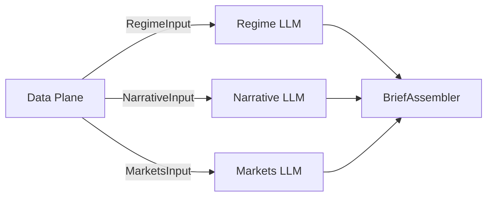

# Investment Agent — Multi-Agent Theme Analysis (v2)

Three domain agents each analyze **disjoint inputs** from a shared Data Plane; a programmatic **Brief Assembler** merges themes with lifecycle stage: **Early / Early-Mid / Mid / Mid-Late / Late**.

| Agent | Role | Input (only) | External data |
|-------|------|--------------|---------------|
| **Regime** | Macro regime themes | `RegimeInput` (date, region) | LLM |
| **Narrative** | Headline narrative heat | `NarrativeInput` (RAG articles) | Finnhub + TickerTick |
| **Markets** | Equity + vol themes | `MarketsInput` (fundamentals, vol) | yfinance |
| **Assembler** | Cluster & rank | Three agent reports | Programmatic (`theme_key`) |

**3 LLM calls** per run (no CIO LLM). **All outputs in English.**

## Stage definitions

| Stage | Code | Meaning |
|-------|------|---------|
| Early | `early` | Theme forming, not fully priced — positioning |
| Early-Mid | `early_mid` | Thesis validating, narrative spreading |
| Mid | `mid` | Trend confirmed, earnings and flows supporting |
| Mid-Late | `mid_late` | Crowded, rich valuations, vol rising |
| Late | `late` | Overheated — exit watch |

## Quick start

```bash
cd investment_agent
python -m venv .venv
source .venv/bin/activate
pip install -e .

cp .env.example .env
# Set GEMINI_API_KEY or OPENAI_API_KEY in .env
```

### Gemini

1. Create an API key at [Google AI Studio](https://aistudio.google.com/apikey)
2. In `.env`:

```bash
LLM_PROVIDER=gemini
GEMINI_API_KEY=your-key
GEMINI_MODEL=gemini-2.5-flash-lite
```

Run:

```bash
python main.py
invest-themes

python main.py --json
python main.py --region US
python main.py -o reports/latest.json
```

### Streamlit dashboard

```bash
streamlit run streamlit_app.py
# or
invest-dashboard
```

1. Select market region, click **Run analysis**
2. Or **Load last result** for `reports/latest.json`
3. Expand **Independent agent themes (before merge)** to compare Regime, Narrative, and Markets outputs

## Environment variables

| Variable | Description |
|----------|-------------|
| `GEMINI_API_KEY` | Gemini key (with `LLM_PROVIDER=gemini`) |
| `GEMINI_MODEL` | Default `gemini-2.5-flash-lite` |
| `LLM_PROVIDER` | `gemini` or `openai` |
| `OPENAI_API_KEY` | OpenAI or compatible API key |
| `MARKET_REGION` | `global`, `US`, `China`, etc. |
| `PIPELINE_VERSION` | Pipeline version (default `2`) |
| `FINNHUB_API_KEY` | Optional; more news via [Finnhub](https://finnhub.io/) |
| `NEWS_MAX_ARTICLES` | Max headlines ingested in Data Plane (default `40`) |
| `RAG_TOP_K` | Articles passed to Narrative agent after retrieval (default `12`) |
| `FUNDAMENTALS_MAX_TICKERS` | Max theme tickers for yfinance fundamentals (default `8`) |
| `RESUME_CHECKPOINT` | Save steps under `reports/cache/` for resume (default `1`) |
| `LLM_MAX_RETRIES_ON_429` | Short rate-limit retries in `llm.py` (default `2`) |

## Architecture

v2 pipeline: **Data Plane** fetches all external data, then **Regime**, **Narrative**, and **Markets** agents each take a **disjoint `*Input`** (no cross-agent outputs). **BriefAssembler** merges themes programmatically into `InvestmentBrief`.

### Theme model

| Phase | What happens |
|-------|----------------|
| **Discover** | Three agents return themes from isolated inputs |
| **Merge** | `BriefAssembler` clusters by `theme_key()` |
| **Trace** | `contributing_agents`, `primary_agent`, `agent_stages` |
| **Rank** | `investability_score` = mean confidence; sorted descending |

Agents do **not** receive other agents' reports. Narrative uses pre-fetched RAG context only. Markets uses fundamentals + vol only. Regime uses date + region only.



### Runtime pipeline

`ThemeOrchestrator.run()` uses **3 LLM requests** (regime, narrative, markets) + programmatic assembler.

```
build_data_plane()           [Finnhub, TickerTick, yfinance — no LLM]
RegimeAgent.analyze()        [LLM → RegimeReport]
NarrativeAgent.analyze()     [LLM → NarrativeReport]  ∥ parallel
MarketsAgent.analyze()       [LLM → MarketsReport]    ∥ parallel
BriefAssembler.assemble()    [programmatic → InvestmentBrief]
```

Checkpoint steps: `data_plane`, `regime`, `narrative`, `markets`.

With `RESUME_CHECKPOINT=1` (default), each completed step is saved under `reports/cache/`. After a quota error, rerun with **Resume from checkpoint** to skip finished steps.

### Agent inputs and external data

| Agent | Input (`*Input`) | Output | External data |
|-------|------------------|--------|---------------|
| **Regime** | `as_of`, `region` | `RegimeReport.themes[]` | LLM only |
| **Narrative** | Pre-retrieved articles + RAG context | `NarrativeReport.themes[]`, citations | Finnhub (optional), TickerTick |
| **Markets** | `FundamentalsSnapshot`, `VolSnapshot` | `equity_themes[]`, `quant_themes[]` | yfinance |
| **Assembler** | Three agent reports | `InvestmentBrief.themes[]` | `theme_key()` clustering (no LLM) |

No agent receives another agent's report. `macro_themes` / `news_themes` / `equity_themes` / `quant_themes` on the brief are **compatibility snapshots** mapped from Regime / Narrative / Markets outputs.

### Repository layout (`src/investment_agent/`)

| Path | Responsibility |
|------|----------------|
| `orchestrator.py` | v2 pipeline, parallel agents, `_enrich_brief()` |
| `data_plane.py` | `build_data_plane()` — all HTTP/yfinance fetch |
| `inputs.py` | `RegimeInput`, `NarrativeInput`, `MarketsInput` |
| `brief_assembler.py` | Programmatic merge → `InvestmentBrief` |
| `agents/regime_agent.py` | Macro regime themes |
| `agents/narrative_agent.py` | News RAG themes + citations |
| `agents/markets_agent.py` | Equity + quant themes from fundamentals/vol |
| `news/ingest.py`, `news/rag.py` | Headline fetch and lexical retrieval |
| `data/snapshot.py`, `market_data.py` | Fundamentals and vol snapshots |
| `themes.py` | `theme_key()` for assembler clustering |
| `checkpoint.py` | Resume cache (`data_plane`, `regime`, `narrative`, `markets`) |
| `llm.py`, `models.py`, `config.py`, `storage.py`, `brief_compat.py` | LLM client, schemas, env, persistence |

Console entry points: `invest-themes` (CLI), `invest-dashboard` (Streamlit).

### Output model

**Per-agent reports (v2):**

- `RegimeReport`, `NarrativeReport`, `MarketsReport` (`MarketsReport` holds `equity_themes` and `quant_themes`)

**Final artifact** — `InvestmentBrief`:

- Views: `macro_view` (regime), `news_view` (narrative), `equity_view` / `quant_view` (markets)
- **Snapshots** (pre-merge): `macro_themes`, `news_themes`, `equity_themes`, `quant_themes`
- **Merged themes**: `themes[]` → `FinalTheme` with `contributing_agents`, `primary_agent`, `agent_stages`, `consensus_score`, `investability_score` (assembler-computed), optional `key_drivers_sourced` / `risks_sourced`
- Metadata: `news_citations`, `data_sources`, `fundamentals_notes`, `report_date`, `as_of_context`

### Cross-cutting behavior

| Concern | Implementation |
|---------|----------------|
| **LLM provider** | Gemini (OpenAI-compatible endpoint) or OpenAI via `config.py` / `.env` |
| **Persistence** | `storage.py` → `reports/latest.json` |
| **Quota / 429** | `llm.py` + `errors.py`; see [Gemini free-tier quota](#gemini-free-tier-quota-429) below |
| **Resume** | `checkpoint.py` + `RESUME_CHECKPOINT` (v2 step names) |
| **Language** | All agent outputs in English |

### Scope (PoC vs production)

**In scope today:** three domain agents with disjoint inputs, programmatic assembler, news RAG with citations, sector-ETF fundamentals, vol snapshot, theme lifecycle staging, CLI + Streamlit.

**Not in scope:** vector embeddings / vector DB, semantic theme clustering beyond `theme_key()`, CI/CD, Bloomberg/FRED feeds.

## Data sources

What each part of the report is based on.

| Output field | Primary source | Notes |
|--------------|----------------|-------|
| `report_date`, `as_of_context` | Local system clock | Set in `dates.py` / `_enrich_brief()` |
| Regime themes, `macro_backdrop`, `dominant_regime` | **LLM** (Regime agent) | `RegimeInput` only |
| Narrative themes, `news_view`, citations, sourced drivers/risks | **Data Plane + LLM** (Narrative) | Headlines via `news/ingest.py`, RAG in Data Plane |
| Headlines ingested | **Finnhub** (optional) + **TickerTick** | Fetched in `data_plane.py` |
| RAG retrieval | **Lexical match** | `news/rag.py` |
| Equity / quant themes, `equity_view`, `quant_view` | **LLM** (Markets) + **yfinance** | `MarketsInput` fundamentals + vol blocks |
| `fundamentals_notes` | **Program** | From `FundamentalsSnapshot.summary_lines()` |
| `macro_themes` … `quant_themes` on brief | **Program** | Mapped in `_enrich_brief()` for UI compat |
| VIX level, sector vol | **yfinance** | `market_data.py` via Data Plane |
| Final `themes[]`, scores, `contributing_agents` | **Program** (`brief_assembler.py`) | `theme_key()` clustering; mean confidence → `investability_score` |
| `key_drivers_sourced` / `risks_sourced` on final themes | **Program** | Attached when cluster includes narrative themes with token overlap |
| `data_sources` | **Program** | Auto-filled in `_enrich_brief()` |

### News ingest (free tier)

| Provider | Auth | Endpoint / usage |
|----------|------|------------------|
| [Finnhub](https://finnhub.io/) | `FINNHUB_API_KEY` (optional) | `GET /api/v1/news?category=general` |
| [TickerTick](https://github.com/hczhu/TickerTick-API) | None | `GET api.tickertick.com/feed?q=T:curated` (10 req/min/IP) |

Without Finnhub, TickerTick alone still powers the news corpus.

### Live market data (yfinance)

Fetched at run time in `src/investment_agent/market_data.py`:

| Label | Symbol | Use |
|-------|--------|-----|
| VIX proxy | `^VIX` | Level and 20-day change |
| Tech | `XLK` | 20-day annualized realized vol |
| Energy | `XLE` | Same |
| Healthcare | `XLV` | Same |
| Financials | `XLF` | Same |
| AI / Cloud | `IGV` | Same |

If yfinance fails or is unavailable, Markets agent continues with degraded vol/fundamentals context (`notes` in snapshots).

### Structured fundamentals (free tier)

Fetched in **Data Plane** via `src/investment_agent/data/` (fixed sector ETF universe, not tied to theme tickers):

| Data | Source | Symbols |
|------|--------|---------|
| 20d / 60d returns, vs 52w high, vs SPY | **yfinance** | Sector ETFs (XLK, XLE, …), SPY |
| Forward / trailing P/E, P/B | **yfinance** `.info` | Same ETF universe (delayed) |

Optional Finnhub revision proxy applies only when extra tickers are added to the snapshot in future; the default pipeline passes an empty theme list (`[]`).

### Gemini free-tier quota (429)

A full run uses **3 LLM requests** (regime, narrative, markets).  
`gemini-2.5-flash-lite` free tier is often **~20 requests/day per project** — about **6 full runs per day**.

If you see `429 RESOURCE_EXHAUSTED` / daily quota:

1. Wait for quota reset (UTC) or use another API key / `LLM_PROVIDER=openai`
2. Sidebar: **Load last result** for `reports/latest.json`
3. Enable **Resume from checkpoint** — partial steps are saved under `reports/cache/` so a retry only calls agents that did not finish

| Variable | Default | Role |
|----------|---------|------|
| `RESUME_CHECKPOINT` | `1` | Save each agent output; resume on next run |
| `LLM_MAX_RETRIES_ON_429` | `2` | Short rate-limit retries (not daily cap) |

### LLM configuration

| Variable | Role |
|----------|------|
| `LLM_PROVIDER` | `gemini` or `openai` |
| `GEMINI_API_KEY` / `OPENAI_API_KEY` | API authentication |
| `GEMINI_MODEL` / `OPENAI_MODEL` | Model id (e.g. `gemini-2.5-flash-lite`) |
| `OPENAI_BASE_URL` | Optional; Gemini uses Google OpenAI-compatible endpoint by default |
| `MARKET_REGION` | Region hint in agent prompts (`global`, `US`, `China`, …) |

### Attribution

- **News-sourced** bullets use `key_drivers_sourced` / `risks_sourced` with `citation_ids` → `news_citations[]` (only on clusters that include narrative themes).
- Plain `key_drivers` / `risks` without citations are merged from agent theme lists.
- Structured metrics use **yfinance** (free, delayed); not Bloomberg/FactSet.
- Regime agent does **not** use FRED/Bloomberg APIs.
- Verify URLs and facts independently before trading.

## Future roadmap

Planned extensions (not implemented in the current PoC):

### Bloomberg as a news and market data backbone

- **News ingest:** Replace or augment TickerTick/Finnhub with **Bloomberg News** (e.g. `BN` feed or equivalent API) for licensed, timestamped headlines aligned with portfolio systems.
- **Cross-asset context:** Pull macro and security-level fields from Bloomberg for Regime and Markets agents.
- **Requirements:** Firm Bloomberg entitlement, API credentials (e.g. B-PIPE / BQL / server API per deployment), compliance logging, and rate/cost controls in the orchestrator.

### Sell-side research agent (replacing or complementing News RAG)

- **Research Agent:** Add a dedicated **equity research report** agent that ingests authorized sell-side PDFs/HTML (broker, date, sector, rating, target price) via Bloomberg Document Search, internal research library, or approved file drop.
- **RAG:** Chunk reports by section (summary, thesis, risks, valuation); retrieval with embeddings + **citation to document id / page** (same pattern as today’s `citation_ids`, extended to `report_id` and page ranges).
- **Pipeline:** Extend v2 Data Plane with licensed research feeds; Markets agent validates stages against cited research.
- **Governance:** Entitlement checks per user/team, no storage of reports outside licensed systems, audit trail on retrieved chunks.

### Other enhancements (backlog)

- Vector RAG for news and research with offline evaluation (citation accuracy, faithfulness).
- Production deployment: API service, scheduled ingest, monitoring, model versioning.
- Optional retention of a **fast news** path (Bloomberg headlines) alongside a **deep research** path (sell-side reports) for a six-agent or dual-track workflow.

*Until Bloomberg and research feeds are connected, the repo uses free-tier news APIs, lexical RAG, and yfinance/Finnhub proxies as documented above.*

## Disclaimer

Output is for research only. Not investment advice.
