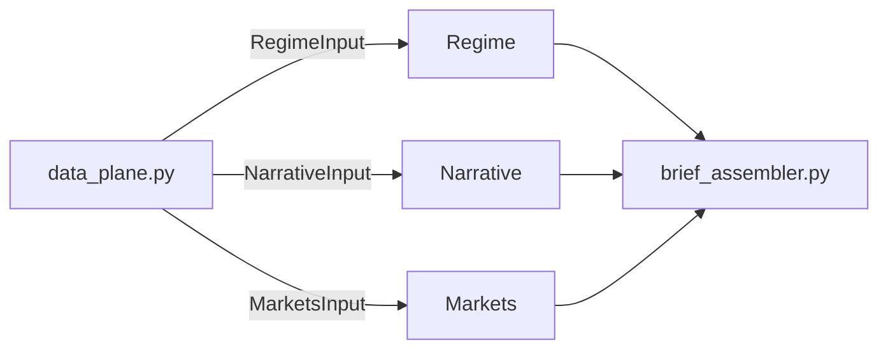

# Investment Agent — Multi-Agent Theme Analysis (v2)

Three domain agents analyze **disjoint inputs** from a shared **Data Plane**; a programmatic **Brief Assembler** merges themes with lifecycle stage: **Early / Early-Mid / Mid / Mid-Late / Late**.

| Agent | Role | Input | External data |
|-------|------|-------|---------------|
| **Regime** | Macro regime themes | `RegimeInput` (date, region, cross-asset context) | yfinance-derived context + LLM |
| **Narrative** | Headline narrative heat | `NarrativeInput` (RAG articles) | Finnhub + TickerTick |
| **Markets** | Equity + vol themes | `MarketsInput` (fundamentals, vol) | yfinance |
| **Assembler** | Cluster & rank | Three agent reports | Programmatic (`theme_key` in `brief_assembler.py`) |

**3 LLM calls** per run (no CIO LLM). **All outputs in English.**

## Stage definitions

| Stage | Code | Meaning |
|-------|------|---------|
| Early | `early` | Theme forming, not fully priced — positioning |
| Early-Mid | `early_mid` | Thesis validating, narrative spreading |
| Mid | `mid` | Trend confirmed, earnings and flows supporting |
| Mid-Late | `mid_late` | Crowded, rich valuations, vol rising |
| Late | `late` | Overheated — exit watch |

## Quick start

```bash
cd investment_agent
python -m venv .venv
source .venv/bin/activate
pip install -e .

cp .env.example .env
# Set GEMINI_API_KEY or OPENAI_API_KEY in .env
```

### Gemini

1. Create an API key at [Google AI Studio](https://aistudio.google.com/apikey)
2. In `.env`:

```bash
LLM_PROVIDER=gemini
GEMINI_API_KEY=your-key
GEMINI_MODEL=gemini-2.5-flash-lite
```

Run:

```bash
python main.py
invest-themes

python main.py --json
python main.py --region US
python main.py -o reports/latest.json
```

### Streamlit dashboard

```bash
streamlit run streamlit_app.py
# or
invest-dashboard
```

1. Select market region, click **Run analysis**
2. Or **Load last result** for `reports/latest.json`
3. Expand **Independent agent themes (before merge)** to compare Regime, Narrative, and Markets outputs

## Environment variables

| Variable | Description |
|----------|-------------|
| `GEMINI_API_KEY` | Gemini key (with `LLM_PROVIDER=gemini`) |
| `GEMINI_MODEL` | Default `gemini-2.5-flash-lite` |
| `LLM_PROVIDER` | `gemini` or `openai` |
| `OPENAI_API_KEY` | OpenAI or compatible API key |
| `MARKET_REGION` | `global`, `US`, `China`, etc. |
| `FINNHUB_API_KEY` | Optional; more news via [Finnhub](https://finnhub.io/) |
| `NEWS_MAX_ARTICLES` | Max headlines ingested in Data Plane (default `40`) |
| `RAG_TOP_K` | Articles passed to Narrative agent after retrieval (default `12`) |
| `FUNDAMENTALS_MAX_TICKERS` | Max theme tickers for yfinance fundamentals (default `8`) |
| `RESUME_CHECKPOINT` | Save steps under `reports/cache/` for resume (default `1`) |
| `LLM_MAX_RETRIES_ON_429` | Short rate-limit retries in `llm.py` (default `2`) |

## Architecture



### Runtime pipeline

```
build_data_plane()           Finnhub, TickerTick, yfinance — no LLM
RegimeAgent.analyze()        LLM → RegimeReport          ∥ parallel
NarrativeAgent.analyze()     LLM → NarrativeReport      ∥ parallel
MarketsAgent.analyze()       LLM → MarketsReport        ∥ parallel
brief_assembler.assemble()   programmatic → InvestmentBrief
```

Checkpoint steps: `data_plane`, `regime`, `narrative`, `markets` (pipeline cache version **3**).

Agents do **not** receive other agents' reports. `macro_themes` / `news_themes` / `equity_themes` / `quant_themes` on the brief are **compatibility snapshots** for the UI.

### Repository layout

```
investment_agent/
├── main.py                 # CLI shim
├── streamlit_app.py        # Streamlit UI
├── tests/test_pipeline.py
└── src/investment_agent/
    ├── orchestrator.py     # pipeline coordinator
    ├── data_plane.py       # *Input types + external fetch + Regime context
    ├── brief_assembler.py  # merge + theme_key()
    ├── agents/             # regime, narrative, markets
    ├── news/               # ingest + lexical RAG
    ├── data/               # fundamentals + vol snapshots (yfinance)
    ├── checkpoint.py       # resume cache
    ├── llm.py              # LLM client + QuotaExhaustedError
    ├── models.py           # Pydantic schemas
    ├── storage.py          # save/load brief + compat accessors
    ├── config.py
    ├── dates.py
    └── cli.py              # invest-themes + invest-dashboard
```

### Module map

| Module | Responsibility |
|--------|----------------|
| `data_plane.py` | `RegimeInput`, `NarrativeInput`, `MarketsInput`, `build_data_plane()`, Regime cross-asset context |
| `brief_assembler.py` | Cluster themes by `theme_key()`, build `InvestmentBrief` |
| `agents/*.py` | One LLM call each |
| `data/snapshot.py` | `FundamentalsSnapshot`, `VolSnapshot`, yfinance fetch |
| `news/` | Headline ingest + lexical retrieval |
| `storage.py` | `reports/latest.json`, `migrate_brief_dict`, UI helper accessors |
| `checkpoint.py` | Partial-run resume under `reports/cache/` |

Console entry points: `invest-themes` → `cli.main`, `invest-dashboard` → `cli.dashboard_main`.

## Data sources

| Output | Source | Notes |
|--------|--------|-------|
| Regime themes, `macro_backdrop` | LLM + **cross-asset context** | Derived in Data Plane from vol + sector ETF snapshot |
| Narrative themes, citations | Data Plane + LLM | Finnhub (optional) + TickerTick |
| Markets themes, views | LLM + yfinance | Full fundamentals + vol blocks |
| Final `themes[]`, scores | `brief_assembler.py` | `theme_key()` clustering; mean confidence → `investability_score` |
| `fundamentals_notes` | Program | `FundamentalsSnapshot.summary_lines()` |

Regime context uses the **same yfinance fetch** as Markets but only a **compact derived summary** (VIX, sector vol, ETF vs SPY returns, rule-based signals)—not news text and not the full Markets prompt blocks.

### Live market data (yfinance)

| Label | Symbol | Use |
|-------|--------|-----|
| VIX proxy | `^VIX` | Level and 20-day change |
| Tech / Energy / Healthcare / Financials / AI-Cloud | `XLK` `XLE` `XLV` `XLF` `IGV` | Sector vol + fundamentals universe |
| Benchmark | `SPY` | Relative performance |

### Gemini free-tier quota (429)

A full run uses **3 LLM requests**. `gemini-2.5-flash-lite` free tier is often **~20 requests/day** (~6 full runs).

On `429 RESOURCE_EXHAUSTED`:

1. Wait for quota reset (UTC) or switch API key / provider
2. **Load last result** from `reports/latest.json`
3. Enable **Resume from checkpoint** — progress under `reports/cache/`

`QuotaExhaustedError` and retry logic live in `llm.py`.

## Tests

```bash
PYTHONPATH=src python -m pytest tests/test_pipeline.py -v
# or without pytest:
PYTHONPATH=src python -c "from tests.test_pipeline import *; ..."
```

## Disclaimer

Output is for research only. Not investment advice.
