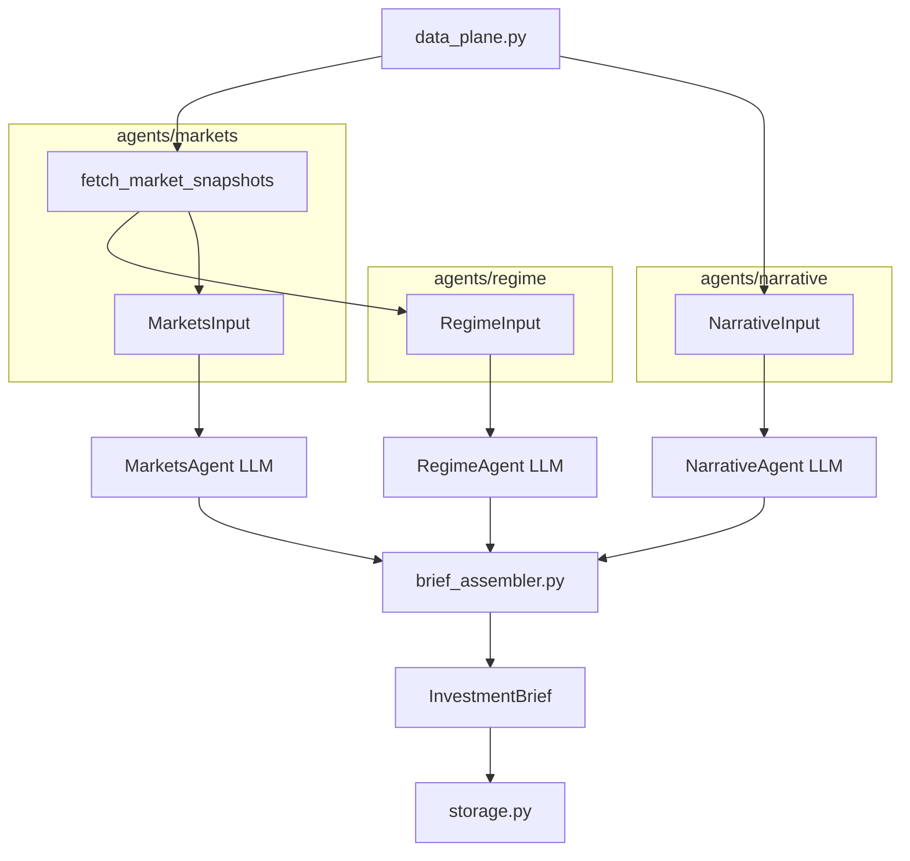

# Investment Agent — Multi-Agent Theme Analysis (v2)

Three domain agents analyze **disjoint inputs** from a shared **Data Plane**; a programmatic **Brief Assembler** merges themes with lifecycle stage: **Early / Early-Mid / Mid / Mid-Late / Late**.

| Agent | Role | Input builder | External data |
|-------|------|---------------|---------------|
| **Regime** | Macro regime themes | `agents/regime/input.py` → `RegimeInput` | yfinance-derived cross-asset summary + LLM |
| **Narrative** | Headline narrative heat | `agents/narrative/input.py` → `NarrativeInput` | Finnhub (optional) + TickerTick RAG |
| **Markets** | Fundamentals + vol themes | `agents/markets/input.py` → `MarketsInput` | yfinance fundamentals + vol snapshots |
| **Assembler** | Cluster & rank | Three agent reports | Programmatic (`theme_key()` in `brief_assembler.py`) |

`data_plane.py` orchestrates the three input builders (no LLM). **3 LLM calls** per run (no CIO LLM). **All outputs in English.**

## Stage definitions

| Stage | Code | Meaning |
|-------|------|---------|
| Early | `early` | Theme forming, not fully priced — positioning |
| Early-Mid | `early_mid` | Thesis validating, narrative spreading |
| Mid | `mid` | Trend confirmed, earnings and flows supporting |
| Mid-Late | `mid_late` | Crowded, rich valuations, vol rising |
| Late | `late` | Overheated — exit watch |

## Quick start

```bash
cd investment_agent
python -m venv .venv
source .venv/bin/activate
pip install -e .

cp .env.example .env
# Set GEMINI_API_KEY or OPENAI_API_KEY in .env
```

### Gemini

1. Create an API key at [Google AI Studio](https://aistudio.google.com/apikey)
2. In `.env`:

```bash
LLM_PROVIDER=gemini
GEMINI_API_KEY=your-key
GEMINI_MODEL=gemini-2.5-flash-lite
```

Run:

```bash
python main.py
invest-themes

python main.py --json
python main.py --region US
python main.py -o reports/latest.json
```

### Streamlit dashboard

```bash
streamlit run streamlit_app.py
# or
invest-dashboard
```

1. Select market region, click **Run analysis**
2. Or **Load last result** for `reports/latest.json`
3. **Agent views** — three tabs: Regime · Narrative · Markets (fundamentals + vol)
4. Expand **Independent agent themes (before merge)** — three columns: Regime · Narrative · Markets

Merged theme cards show contributor pills (`regime`, `narrative`, `markets`).

## Environment variables

| Variable | Description |
|----------|-------------|
| `GEMINI_API_KEY` | Gemini key (with `LLM_PROVIDER=gemini`) |
| `GEMINI_MODEL` | Default in code: `gemini-2.0-flash`; `.env.example` suggests `gemini-2.5-flash-lite` |
| `LLM_PROVIDER` | `gemini` or `openai` |
| `OPENAI_API_KEY` | OpenAI or compatible API key |
| `OPENAI_BASE_URL` | Optional; Gemini uses Google OpenAI-compatible endpoint by default |
| `OPENAI_MODEL` | OpenAI model id when using `LLM_PROVIDER=openai` |
| `MARKET_REGION` | `global`, `US`, `China`, etc. |
| `FINNHUB_API_KEY` | Optional; more Narrative headlines via [Finnhub](https://finnhub.io/) |
| `NEWS_MAX_ARTICLES` | Max headlines for Narrative ingest (default `40`) |
| `RAG_TOP_K` | Articles passed to Narrative LLM after retrieval (default `12`) |
| `FUNDAMENTALS_MAX_TICKERS` | Max extra tickers for Markets fundamentals fetch (default `8`) |
| `RESUME_CHECKPOINT` | Save steps under `reports/cache/` for resume (default `1`) |
| `LLM_MAX_RETRIES_ON_429` | Short rate-limit retries in `llm.py` (default `2`) |

## Architecture



### Runtime pipeline (`orchestrator.py`)

```
build_data_plane()                    no LLM
  ├─ agents/markets/input.py          fetch_market_snapshots() → MarketSnapshots
  ├─ agents/regime/input.py           build_regime_input(snapshots) → RegimeInput
  ├─ agents/narrative/input.py        build_narrative_input() → NarrativeInput
  └─ agents/markets/input.py          build_markets_input(snapshots) → MarketsInput

RegimeAgent.analyze()                 LLM → RegimeReport          ∥ parallel
NarrativeAgent.analyze()              LLM → NarrativeReport      ∥ parallel
MarketsAgent.analyze()                LLM → MarketsReport        ∥ parallel

brief_assembler.assemble()            programmatic → InvestmentBrief
_enrich_brief()                       dates, data_sources, per-agent theme snapshots
```

**Checkpoint steps:** `data_plane`, `regime`, `narrative`, `markets` under `reports/cache/`. Cache metadata uses **pipeline version 5** (`checkpoint.py`); older caches are cleared on resume.

Agents do **not** receive other agents' reports. Inputs are **pairwise disjoint** (Regime gets a derived summary, not news text or full Markets prompt blocks).

### Agent ↔ data mapping

| Package | Data modules | `*Input` fields | Fed to LLM as |
|---------|--------------|---------------|---------------|
| `agents/regime/` | `input.py` (slice from `MarketSnapshots`) | `regime_context_block` | Cross-asset regime markdown |
| `agents/narrative/` | `ingest.py`, `rag.py`, `input.py` | `context_block`, `retrieved` | Headline RAG block |
| `agents/markets/` | `snapshot.py`, `price.py`, `valuation.py`, `revisions.py`, `universe.py`, `input.py` | `fundamentals`, `vol` | Full fundamentals + vol prompt blocks |

Markets performs the **only yfinance fetch** per run (`fetch_market_snapshots`). Regime reuses that payload as a compact summary (no second network round-trip).

### Brief fields

| Brief field | Agent report |
|-------------|--------------|
| `regime_view`, `regime_themes` | `RegimeReport` |
| `narrative_view`, `narrative_themes`, `narrative_citations` | `NarrativeReport` |
| `markets_fundamentals_view`, `markets_vol_view`, `markets_themes` | `MarketsReport` (`fundamentals_themes` + `vol_themes`) |

Merged `FinalTheme.contributing_agents` / `primary_agent` use `regime`, `narrative`, `markets`.

Loading older `reports/latest.json` files migrates legacy field names (`macro_view`, `news_themes`, etc.) via `storage.migrate_brief_dict()`.

### Repository layout

```
investment_agent/
├── main.py
├── streamlit_app.py
├── tests/test_pipeline.py
├── research/data-agent-relationship.md
├── reports/
│   ├── latest.json
│   └── cache/
└── src/investment_agent/
    ├── orchestrator.py
    ├── data_plane.py              # orchestrates build_data_plane(); re-exports *Input
    ├── brief_assembler.py
    ├── agents/
    │   ├── regime/
    │   │   ├── agent.py           # RegimeAgent (LLM)
    │   │   └── input.py           # RegimeInput, build_regime_input()
    │   ├── narrative/
    │   │   ├── agent.py           # NarrativeAgent (LLM)
    │   │   ├── input.py           # NarrativeInput, build_narrative_input()
    │   │   ├── ingest.py          # Finnhub + TickerTick
    │   │   └── rag.py             # lexical retrieval
    │   └── markets/
    │       ├── agent.py           # MarketsAgent (LLM)
    │       ├── input.py           # MarketsInput, fetch_market_snapshots()
    │       ├── snapshot.py        # FundamentalsSnapshot, VolSnapshot
    │       └── universe.py, price.py, valuation.py, revisions.py
    ├── checkpoint.py
    ├── llm.py
    ├── models.py
    ├── storage.py
    ├── config.py
    ├── dates.py
    └── cli.py
```

Console scripts (`pyproject.toml`): `invest-themes` → `cli.main`, `invest-dashboard` → `cli.dashboard_main`.

## Data sources

| Output | Source | Notes |
|--------|--------|-------|
| `report_date`, `as_of_context` | Local clock | `dates.py` + `_enrich_brief()` |
| Regime themes, `regime_backdrop`, `dominant_regime` | LLM + cross-asset context | `agents/regime/input.py` |
| Narrative themes, citations, sourced drivers/risks | LLM + RAG | `agents/narrative/` |
| Markets themes, fundamentals/vol views | LLM + yfinance | `agents/markets/snapshot.py` prompt blocks |
| `fundamentals_notes` | Program | `FundamentalsSnapshot.summary_lines()` |
| Final `themes[]`, scores, `contributing_agents` | `brief_assembler.py` | `theme_key()` clustering |
| `key_drivers_sourced` / `risks_sourced` | Program | When merged cluster includes narrative themes |
| `data_sources` | Program | `_enrich_brief()` |

### Regime cross-asset context

Built in `agents/regime/input.py` from the same `MarketSnapshots` as Markets:

- VIX level and 20d change
- Sector 20d annualized vol (XLK, XLE, XLV, XLF, IGV)
- ETF 20d returns and vs-SPY spreads
- Rule-based `signals` from the fundamentals snapshot

No news text; no full per-symbol Markets prompt.

### Narrative ingest (free tier)

| Provider | Auth | Used in |
|----------|------|---------|
| [Finnhub](https://finnhub.io/) | `FINNHUB_API_KEY` (optional) | `agents/narrative/ingest.py` |
| [TickerTick](https://github.com/hczhu/TickerTick-API) | None | `agents/narrative/ingest.py` |

Corpus capped by `NEWS_MAX_ARTICLES`; `RAG_TOP_K` articles enter the Narrative LLM prompt.

### Live market data (yfinance)

Fetched in `agents/markets/snapshot.py`:

| Label | Symbol | Use |
|-------|--------|-----|
| VIX proxy | `^VIX` | Level and 20-day change |
| Tech / Energy / Healthcare / Financials / AI-Cloud | `XLK` `XLE` `XLV` `XLF` `IGV` | Sector vol + fundamentals universe |
| Benchmark | `SPY` | Relative performance |

Universe is fixed sector ETFs + SPY (`agents/markets/universe.py`). `FUNDAMENTALS_MAX_TICKERS` caps optional extra symbols if enabled later.

### Gemini free-tier quota (429)

A full run uses **3 LLM requests**. `gemini-2.5-flash-lite` free tier is often **~20 requests/day** (~6 full runs).

On `429 RESOURCE_EXHAUSTED`:

1. Wait for quota reset (UTC) or switch API key / `LLM_PROVIDER`
2. **Load last result** from `reports/latest.json`
3. Enable **Resume from checkpoint** — partial progress under `reports/cache/`

`QuotaExhaustedError` and retry logic are in `llm.py`.

## Tests

```bash
pip install pytest   # optional
PYTHONPATH=src python -m pytest tests/test_pipeline.py -v
```

Covers per-agent input builders, `build_data_plane()` wiring, `brief_assembler.assemble()` clustering, and legacy brief JSON migration.

## Disclaimer

Output is for research only. Not investment advice.
