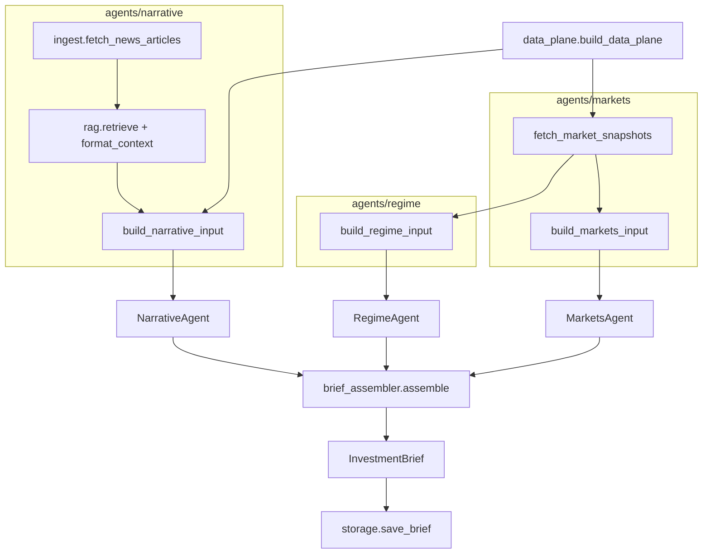

# Investment Agent — Multi-Agent Theme Analysis (v2)

Three domain agents analyze **disjoint inputs** from a shared **Data Plane**; a programmatic **Brief Assembler** merges themes by **sector**, scores them, and ranks by **investability + consensus**. Lifecycle stages: **Early / Early-Mid / Mid / Mid-Late / Late**.

| Agent | Role | Package | External data |
|-------|------|---------|---------------|
| **Regime** | Macro regime themes | `agents/regime/` | yfinance-derived cross-asset summary + LLM |
| **Narrative** | Headline narrative heat | `agents/narrative/` | Finnhub (optional) + TickerTick → RAG + LLM |
| **Markets** | Fundamentals + vol themes | `agents/markets/` | yfinance fundamentals + vol snapshots + LLM |
| **Assembler** | Sector merge & rank | `brief_assembler.py` | Programmatic (no LLM) |

`data_plane.py` orchestrates input builders (no LLM). **3 LLM calls** per run. **All agent outputs in English.**

## Stage definitions

| Stage | Code | Meaning |
|-------|------|---------|
| Early | `early` | Theme forming, not fully priced — positioning |
| Early-Mid | `early_mid` | Thesis validating, narrative spreading |
| Mid | `mid` | Trend confirmed, earnings and flows supporting |
| Mid-Late | `mid_late` | Crowded, rich valuations, vol rising |
| Late | `late` | Overheated — exit watch |

## Quick start

```bash
cd investment_agent
python -m venv .venv
source .venv/bin/activate
pip install -e .

cp .env.example .env
# Set GEMINI_API_KEY or OPENAI_API_KEY (Groq / OpenRouter / OpenAI)
```

### Groq (recommended for local dev)

```bash
LLM_PROVIDER=openai
OPENAI_API_KEY=gsk_...
OPENAI_BASE_URL=https://api.groq.com/openai/v1
OPENAI_MODEL=llama-3.3-70b-versatile

MARKET_REGION=global
RESUME_CHECKPOINT=1

# Groq on-demand ~12k tokens/request — keep narrative RAG small
RAG_TOP_K=5
RAG_SUMMARY_MAX_CHARS=180
RAG_CONTEXT_MAX_CHARS=3000
NEWS_MAX_ARTICLES=25
```

Groq defaults (when vars unset): **sequential** agents, **compact JSON schema**, capped news context. After `.env` changes: **restart** Streamlit/CLI. On Narrative prompt-too-large: **Clear checkpoint** (stale `data_plane.json` may cache an oversized `context_block`).

### Gemini / OpenRouter / OpenAI

See commented blocks in `.env.example`. OpenRouter `:free` models run **sequentially** with delay by default.

```bash
python main.py              # or: invest-themes
python main.py --json
python main.py --region US
python main.py -o reports/latest.json

streamlit run streamlit_app.py   # or: invest-dashboard
```

**Streamlit:** Run analysis · Load last result · Resume / Clear checkpoint · Agent tabs · Recommended themes (one card per sector, sorted by score). Switch **View → Portfolio** for trade ledger.

### Portfolio ledger

Record trades, view open positions, and track performance (mark-to-market via yfinance, vs SPY). Data stored locally in `reports/portfolio.db`.

```bash
invest-portfolio add-trade AAPL buy 10 175.50 --date 2026-01-15
invest-portfolio list-trades
invest-portfolio delete-trade 3
invest-portfolio list-trades --symbol AAPL
invest-portfolio positions
invest-portfolio performance
invest-portfolio performance --from 2026-01-01 --to 2026-06-30
```

Or use the **Portfolio** tab in `invest-dashboard`. Override DB path with `PORTFOLIO_DB_PATH`.

Weighted average cost; sells exceeding holdings are rejected. Back up `reports/portfolio.db` before upgrades.

## Environment variables

| Variable | Description |
|----------|-------------|
| `LLM_PROVIDER` | `gemini` or `openai` (Groq / OpenRouter use `openai` + `OPENAI_BASE_URL`) |
| `GEMINI_API_KEY` / `GEMINI_MODEL` | Google AI Studio |
| `OPENAI_API_KEY` / `OPENAI_BASE_URL` / `OPENAI_MODEL` | OpenAI-compatible APIs |
| `MARKET_REGION` | `global`, `US`, `China`, etc. |
| `FINNHUB_API_KEY` | Optional Narrative headlines ([Finnhub](https://finnhub.io/)) |
| `NEWS_MAX_ARTICLES` | Headlines ingested (Groq default **25**) |
| `RAG_TOP_K` | Articles in Narrative LLM prompt (Groq default **5**) |
| `RAG_SUMMARY_MAX_CHARS` | Per-article summary cap (Groq default **180**) |
| `RAG_CONTEXT_MAX_CHARS` | Total narrative context cap (Groq default **3000**) |
| `FUNDAMENTALS_MAX_TICKERS` | Max extra tickers for Markets (default `8`) |
| `RESUME_CHECKPOINT` | Checkpoint under `reports/cache/` (default `1`) |
| `LLM_PARALLEL_AGENTS` | `1` = parallel LLM; Groq / OpenRouter `:free` default **off** |
| `LLM_AGENT_DELAY_SECONDS` | Delay between sequential calls (OpenRouter `:free`) |
| `LLM_COMPACT_SCHEMA` | `1` = smaller JSON schema in LLM system prompt |
| `LLM_MAX_RETRIES_ON_429` | Rate-limit retries in `llm.py` |
| `PORTFOLIO_DB_PATH` | Portfolio SQLite file (default `reports/portfolio.db`) |

Provider-aware defaults: `config.py` (`is_groq`, `is_openrouter_free`).

## Architecture



### Runtime pipeline (`orchestrator.py`)

```
build_data_plane()                         no LLM
  ├─ markets/input.fetch_market_snapshots  → MarketSnapshots (yfinance, once)
  ├─ regime/input.build_regime_input       → RegimeInput (summary slice)
  ├─ narrative/input.build_narrative_input → NarrativeInput (ingest + RAG)
  └─ markets/input.build_markets_input     → MarketsInput (full snapshots)

RegimeAgent.analyze(RegimeInput)           LLM → RegimeReport
NarrativeAgent.analyze(NarrativeInput)     LLM → NarrativeReport    } parallel or sequential*
MarketsAgent.analyze(MarketsInput)         LLM → MarketsReport

brief_assembler.assemble()                 sector merge, scores, rank → themes[]
orchestrator._enrich_brief()               dates, data_sources, agent theme snapshots
```

\* **Groq** and **OpenRouter `:free`**: sequential by default (`config.llm_parallel_agents`).

**Checkpoint** (`checkpoint.py`, version **6**): `data_plane`, `regime`, `narrative`, `markets` under `reports/cache/`. On resume, narrative context is **re-truncated** to current `RAG_*` limits.

Agents never receive other agents' `*Report` objects. Inputs are **pairwise disjoint**.

## Package layout (runtime)

Each agent is a **folder** with a clear split: **data prep** vs **LLM**.

```
src/investment_agent/
├── data_plane.py              # build_data_plane(); wires all *Input builders
├── orchestrator.py            # ThemeOrchestrator.run()
├── brief_assembler.py         # sector merge, scoring, rank
├── checkpoint.py              # PIPELINE_VERSION=6
├── llm.py                     # structured JSON; 429 / 413 handling
├── models.py                  # *Report, FinalTheme, InvestmentBrief
├── storage.py                 # save/load brief; normalize_brief_dict()
├── config.py                  # Settings.from_env()
├── dates.py
├── cli.py
├── universe/                  # shared sector ETF registry (Markets, Regime, BriefAssembler)
│   ├── constants.py           # SECTOR_ETFS, TICKER_TO_SECTOR, VOL_SECTOR_LABELS
│   └── symbols.py             # symbols_for_fundamentals, vol_labeled_symbols
└── agents/
    ├── regime/
    │   ├── agent.py           # RegimeAgent — LLM only
    │   └── input.py           # RegimeInput, build_regime_input() from MarketSnapshots
    ├── narrative/
    │   ├── ingest.py          # HTTP fetch: Finnhub + TickerTick → NewsArticle[]
    │   ├── rag.py             # lexical retrieve + truncate → context_block
    │   ├── input.py           # build_narrative_input() → NarrativeInput
    │   └── agent.py           # NarrativeAgent — LLM only (reads context_block)
    └── markets/
        ├── input.py           # fetch_market_snapshots(), build_markets_input()
        ├── snapshot.py        # FundamentalsSnapshot, VolSnapshot, yfinance fetch
        ├── price.py           # PriceMetrics
        ├── valuation.py       # ValuationMetrics
        ├── revisions.py       # optional Finnhub revision lines
        └── agent.py           # MarketsAgent — LLM only
```

### Why Narrative has `ingest` + `rag` + `input`

| Module | Responsibility | LLM? |
|--------|----------------|------|
| **`ingest.py`** | Pull raw headlines from external APIs, dedupe, cap corpus | No |
| **`rag.py`** | Build retrieval query, score articles by keywords, format truncated `context_block` | No |
| **`input.py`** | Orchestrate ingest + RAG into frozen `NarrativeInput` for checkpoint/resume | No |
| **`agent.py`** | Single LLM call: headlines → `NarrativeReport` + themes + citations | Yes |

This matches the project rule: **fetch and slice before any LLM**; Narrative never calls `httpx` inside `agent.py`.

### Markets vs Regime (shared yfinance)

| | Markets | Regime |
|---|---------|--------|
| **Fetch** | `fetch_market_snapshots()` in `markets/input.py` | Reuses same `MarketSnapshots` |
| **Slice** | Full `fundamentals` + `vol` prompt blocks | Compact `regime_context_block` in `regime/input.py` |
| **LLM lens** | Fundamentals themes + vol themes | Macro regime themes |

### Brief assembler

1. **Collect** all `AgentTheme` rows from three reports (Markets contributes fundamentals + vol lists).
2. **Cluster by sector** — one `FinalTheme` per sector when title/ticker maps to financials, tech, energy, etc.; non-sector themes cluster by title similarity.
3. **Score each cluster:**
   - **Investability** = mean of `confidence` across themes in the cluster (0–1, from each agent's LLM output).
   - **Consensus** = `min(1.0, distinct_agents / 3)` — how many of Regime / Narrative / Markets contributed (not stage agreement).
4. **Rank** `themes[]` by `investability_score + consensus_score` (desc), keep top **8**.
5. **Display** normalized sector name (e.g. `Financials`, `Tech`).

### `InvestmentBrief` fields

| Field | Source |
|-------|--------|
| `regime_view`, `regime_themes` | `RegimeReport` |
| `narrative_view`, `narrative_themes`, `narrative_citations` | `NarrativeReport` |
| `markets_fundamentals_view`, `markets_vol_view`, `markets_themes` | `MarketsReport` |
| `themes[]` | Merged `FinalTheme` (sector-deduped, scored, ranked) |
| `fundamentals_notes` | `FundamentalsSnapshot.summary_lines()` |

Legacy theme display fields (`name_zh`, `stage_label_zh`) normalize on load via `storage.normalize_brief_dict()`.

## Data sources

### Narrative ingest

| Provider | Auth | Module |
|----------|------|--------|
| [Finnhub](https://finnhub.io/) | `FINNHUB_API_KEY` (optional) | `agents/narrative/ingest.py` |
| [TickerTick](https://github.com/hczhu/TickerTick-API) | None | `agents/narrative/ingest.py` |

Corpus capped by `NEWS_MAX_ARTICLES`; `RAG_TOP_K` articles after lexical retrieval; summaries truncated by `RAG_SUMMARY_MAX_CHARS` / `RAG_CONTEXT_MAX_CHARS`.

### Live market data (yfinance)

| Label | Symbol | Use |
|-------|--------|-----|
| VIX proxy | `^VIX` | Level and 20d change |
| Sectors | `XLK` `XLE` `XLV` `XLF` `AIQ` `SKYY` `XLY` `XLI` `XLU` | Fundamentals (all) |
| Vol subset | `XLK` `XLE` `XLV` `XLF` `AIQ` `SKYY` + `^VIX` | Ann. vol only |
| Benchmark | `SPY` | Relative performance |

Defined in `universe/constants.py`. Single fetch per run in `fetch_market_snapshots()`.

## LLM providers & limits

| Provider | Typical constraint | Mitigation |
|----------|-------------------|------------|
| Gemini flash-lite | ~20 req/day | Checkpoint resume, `latest.json` |
| Groq on-demand | ~12k tokens/request | Low `RAG_*`, compact schema, clear checkpoint |
| OpenRouter `:free` | ~50/day, ~20/min | Sequential agents, delay |

Errors: `QuotaExhaustedError` (429), prompt-too-large (413) — see `llm.py` hints.

## Roadmap: Portfolio management

**Implemented (ledger):** manual trade recording, weighted-avg positions, mark-to-market P&L, CLI (`invest-portfolio`) and Streamlit **Portfolio** tab. See `research/portfolio-ledger-design.md`.

**Planned (theme alignment):** programmatic module after `brief_assembler` — suggested allocation from top themes, drift vs holdings, optional constraints. Does **not** feed holdings into agent prompts.

Optional design notes may live under `research/` (not required to run the pipeline).

## Tests

```bash
pip install pytest
PYTHONPATH=src python -m pytest tests/test_pipeline.py tests/test_portfolio.py -v
```

Covers: data plane wiring, regime context, sector clustering & ranking, RAG truncation, legacy brief migration, portfolio ledger.

## Disclaimer

For research only. Not investment advice.
