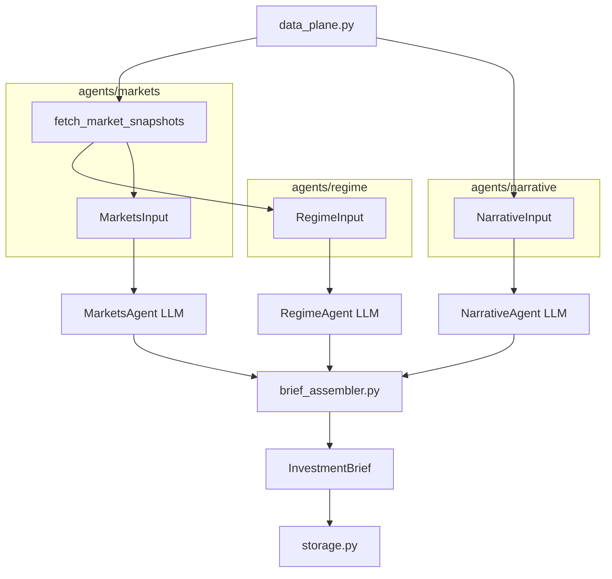
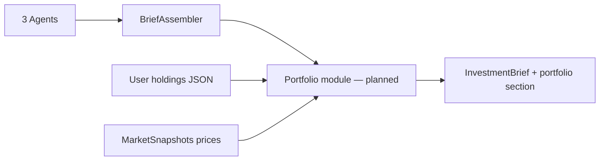

# Investment Agent — Multi-Agent Theme Analysis (v2)

Three domain agents analyze **disjoint inputs** from a shared **Data Plane**; a programmatic **Brief Assembler** merges themes by **sector** and lifecycle stage: **Early / Early-Mid / Mid / Mid-Late / Late**.

| Agent | Role | Input builder | External data |
|-------|------|---------------|---------------|
| **Regime** | Macro regime themes | `agents/regime/input.py` → `RegimeInput` | yfinance-derived cross-asset summary + LLM |
| **Narrative** | Headline narrative heat | `agents/narrative/input.py` → `NarrativeInput` | Finnhub (optional) + TickerTick RAG |
| **Markets** | Fundamentals + vol themes | `agents/markets/input.py` → `MarketsInput` | yfinance fundamentals + vol snapshots |
| **Assembler** | Sector merge & rank | Three agent reports | Programmatic (`brief_assembler.py`) |

`data_plane.py` orchestrates the three input builders (no LLM). **3 LLM calls** per run (no CIO LLM). **All outputs in English.**

## Stage definitions

| Stage | Code | Meaning |
|-------|------|---------|
| Early | `early` | Theme forming, not fully priced — positioning |
| Early-Mid | `early_mid` | Thesis validating, narrative spreading |
| Mid | `mid` | Trend confirmed, earnings and flows supporting |
| Mid-Late | `mid_late` | Crowded, rich valuations, vol rising |
| Late | `late` | Overheated — exit watch |

## Quick start

```bash
cd investment_agent
python -m venv .venv
source .venv/bin/activate
pip install -e .

cp .env.example .env
# Set GEMINI_API_KEY or OPENAI_API_KEY (Groq / OpenRouter / OpenAI) in .env
```

### Groq (current default in `.env.example`)

1. Create an API key at [Groq Console](https://console.groq.com/keys)
2. In `.env`:

```bash
LLM_PROVIDER=openai
OPENAI_API_KEY=gsk_...
OPENAI_BASE_URL=https://api.groq.com/openai/v1
OPENAI_MODEL=llama-3.3-70b-versatile

MARKET_REGION=global
RESUME_CHECKPOINT=1

# Groq on-demand ~12k tokens/request — keep narrative RAG small
RAG_TOP_K=5
RAG_SUMMARY_MAX_CHARS=180
RAG_CONTEXT_MAX_CHARS=3000
NEWS_MAX_ARTICLES=25
```

Groq defaults (when vars are unset): **sequential** agents, compact JSON schema, capped news context. After changing `.env`, **restart** Streamlit/CLI. If Narrative fails with prompt-too-large, click **Clear checkpoint** in the sidebar (stale `data_plane` cache can hold an oversized context block).

### Gemini

1. Create an API key at [Google AI Studio](https://aistudio.google.com/apikey)
2. In `.env`:

```bash
LLM_PROVIDER=gemini
GEMINI_API_KEY=your-key
GEMINI_MODEL=gemini-2.5-flash-lite
```

### OpenRouter / OpenAI

See commented blocks in `.env.example` for OpenRouter (`:free` models run sequentially) and OpenAI (`gpt-4o`).

Run:

```bash
python main.py
invest-themes

python main.py --json
python main.py --region US
python main.py -o reports/latest.json
```

### Streamlit dashboard

```bash
streamlit run streamlit_app.py
# or
invest-dashboard
```

1. Select market region, click **Run analysis**
2. Or **Load last result** for `reports/latest.json`
3. **Resume from checkpoint** — skip completed agents (`reports/cache/`)
4. **Clear checkpoint** — after `.env` or RAG limit changes
5. **Agent views** — Regime · Narrative · Markets tabs
6. **Recommended themes** — one card per sector (e.g. Financials, Tech); pills show each agent's stage (`—` if that agent had no matching theme)

## Environment variables

| Variable | Description |
|----------|-------------|
| `LLM_PROVIDER` | `gemini` or `openai` (Groq / OpenRouter use `openai` + `OPENAI_BASE_URL`) |
| `GEMINI_API_KEY` / `GEMINI_MODEL` | Gemini via Google AI Studio |
| `OPENAI_API_KEY` / `OPENAI_BASE_URL` / `OPENAI_MODEL` | OpenAI-compatible APIs (Groq, OpenRouter, OpenAI) |
| `MARKET_REGION` | `global`, `US`, `China`, etc. |
| `FINNHUB_API_KEY` | Optional; more Narrative headlines via [Finnhub](https://finnhub.io/) |
| `NEWS_MAX_ARTICLES` | Max headlines ingested (Groq default **25** if unset) |
| `RAG_TOP_K` | Articles in Narrative LLM prompt (Groq default **5** if unset) |
| `RAG_SUMMARY_MAX_CHARS` | Per-article summary cap in context block (Groq default **180**) |
| `RAG_CONTEXT_MAX_CHARS` | Total narrative context cap (Groq default **3000**) |
| `FUNDAMENTALS_MAX_TICKERS` | Max extra tickers for Markets fundamentals (default `8`) |
| `RESUME_CHECKPOINT` | Save steps under `reports/cache/` (default `1`) |
| `LLM_PARALLEL_AGENTS` | `1` = parallel LLM calls; Groq/OpenRouter `:free` default **off** |
| `LLM_AGENT_DELAY_SECONDS` | Delay between sequential agent calls (OpenRouter `:free`) |
| `LLM_COMPACT_SCHEMA` | `1` = strip JSON schema descriptions in LLM system prompt |
| `LLM_MAX_RETRIES_ON_429` | Short rate-limit retries in `llm.py` |

Provider-aware defaults live in `config.py` (`is_groq`, `is_openrouter_free`).

## Architecture



### Runtime pipeline (`orchestrator.py`)

```
build_data_plane()                    no LLM
  ├─ agents/markets/input.py          fetch_market_snapshots() → MarketSnapshots
  ├─ agents/regime/input.py           build_regime_input(snapshots) → RegimeInput
  ├─ agents/narrative/input.py        build_narrative_input() → NarrativeInput
  └─ agents/markets/input.py          build_markets_input(snapshots) → MarketsInput

RegimeAgent.analyze()                 LLM → RegimeReport          ∥ or sequential*
NarrativeAgent.analyze()              LLM → NarrativeReport      ∥ or sequential*
MarketsAgent.analyze()                LLM → MarketsReport        ∥ or sequential*

brief_assembler.assemble()            sector merge + rank → InvestmentBrief
_enrich_brief()                       dates, data_sources, per-agent theme snapshots
```

\* **Groq** and **OpenRouter `:free`** run agents **sequentially** by default to avoid rate/token bursts.

**Checkpoint steps:** `data_plane`, `regime`, `narrative`, `markets` under `reports/cache/`. Cache metadata uses **pipeline version 6** (`checkpoint.py`); older caches are cleared on resume. On resume, narrative `context_block` is **re-truncated** to current RAG limits.

Agents do **not** receive other agents' reports. Inputs are **pairwise disjoint**.

### Brief assembler (sector merge)

`brief_assembler.py` groups agent themes into **one `FinalTheme` per sector** when possible:

- Sector from theme title keywords (financials, tech, energy, …) or ETF tickers (XLF, XLK, …)
- Regime + Narrative + Markets themes on the same sector → **single card** with multiple agent pills
- Display name normalized (e.g. `Financials`, `Tech`)
- Non-sector macro themes clustered by title similarity

### Agent ↔ data mapping

| Package | Data modules | `*Input` fields | Fed to LLM as |
|---------|--------------|---------------|---------------|
| `agents/regime/` | `input.py` | `regime_context_block` | Cross-asset regime markdown |
| `agents/narrative/` | `ingest.py`, `rag.py`, `input.py` | `context_block`, `retrieved` | Truncated headline RAG block |
| `agents/markets/` | `snapshot.py`, `universe.py`, … | `fundamentals`, `vol` | Full fundamentals + vol prompt blocks |

Markets performs the **only yfinance fetch** per run. Regime reuses that payload as a compact summary.

### Brief fields

| Brief field | Agent report |
|-------------|--------------|
| `regime_view`, `regime_themes` | `RegimeReport` |
| `narrative_view`, `narrative_themes`, `narrative_citations` | `NarrativeReport` |
| `markets_fundamentals_view`, `markets_vol_view`, `markets_themes` | `MarketsReport` |
| `themes[]` | Merged `FinalTheme` rows (sector-deduped) |

Loading older `reports/latest.json` migrates legacy names (`macro_view`, `news_themes`, …) via `storage.migrate_brief_dict()`.

### Repository layout

```
investment_agent/
├── main.py
├── streamlit_app.py
├── tests/test_pipeline.py
├── research/                      # design notes (incl. data-agent map)
├── reports/
│   ├── latest.json
│   └── cache/                     # checkpoint resume
└── src/investment_agent/
    ├── orchestrator.py
    ├── data_plane.py
    ├── brief_assembler.py         # sector merge + theme_key clustering
    ├── agents/regime|narrative|markets/
    ├── checkpoint.py              # PIPELINE_VERSION=6
    ├── llm.py                     # structured JSON, 429/413 handling
    ├── models.py
    ├── storage.py
    ├── config.py
    └── cli.py
```

Console scripts: `invest-themes`, `invest-dashboard`.

## Data sources

| Output | Source |
|--------|--------|
| Regime themes, cross-asset context | LLM + `agents/regime/input.py` |
| Narrative themes, citations | LLM + truncated RAG (`agents/narrative/`) |
| Markets themes, fundamentals/vol views | LLM + yfinance |
| Final `themes[]`, sector labels, agent stages | `brief_assembler.py` |
| `data_sources`, `fundamentals_notes` | `_enrich_brief()` |

### Sector ETF universe (`agents/markets/universe.py`)

XLK, XLE, XLV, XLF, IGV, XLY, XLI, XLU, SPY, ^VIX — used for Markets/Regime snapshots and sector tagging in the assembler.

### LLM quotas & errors

| Provider | Typical limit | Mitigation |
|----------|---------------|------------|
| Gemini flash-lite | ~20 req/day | `RESUME_CHECKPOINT=1`, load `latest.json` |
| Groq on-demand | ~12k **tokens/request** | Low `RAG_*` vars, compact schema, clear checkpoint |
| OpenRouter `:free` | ~50/day, ~20/min | Sequential agents + delay |

`QuotaExhaustedError` (429) and prompt-too-large (413) hints are in `llm.py`. Use sidebar **Resume from checkpoint** or **Load last result**.

## Roadmap: Portfolio management

Today the pipeline is **theme discovery only** — no holdings, weights, or rebalance logic. Portfolio management fits **after** `brief_assembler.assemble()`, as a **programmatic module** (not a 4th parallel agent), to preserve agent input isolation.



### Design principles

- **Input:** `PortfolioInput` (holdings, cash %, risk profile, max single-name weight) — user-supplied, not from other agents' LLM reports
- **Signal:** `FinalTheme[]` — `investability_score`, `stage`, `tickers_or_sectors`
- **Prices:** reuse `MarketSnapshots` / yfinance (no new fetch layer in v1)
- **No broker execution** — research and drift analysis only; disclaimer unchanged

### Planned phases

| Phase | Scope | Deliverable |
|-------|--------|-------------|
| **P1 — Model portfolio** | No user holdings | `suggested_allocation` from top themes → sector ETF weights (XLF, XLK, …); Streamlit pie chart |
| **P2 — Holdings alignment** | User portfolio file / sidebar form | `current_vs_target` drift table, `theme_alignment_score`, rebalance hints (symbol, current %, target %, delta %) |
| **P3 — Constraints & narrative** | Risk caps, min cash | `portfolio_optimizer.py` (heuristic, no LP required); optional LLM **narrator** that explains pre-computed numbers only |

### Proposed modules (not implemented yet)

```
src/investment_agent/
├── portfolio/
│   ├── models.py          # PortfolioInput, Position, PortfolioReport
│   ├── suggest.py         # P1 theme → target weights
│   ├── alignment.py       # P2 drift vs holdings
│   └── optimizer.py       # P3 constraints (optional)
```

`InvestmentBrief` would gain optional fields: `suggested_allocation`, `portfolio_alignment`, `rebalance_suggestions[]`.

### Out of scope (for now)

- Live trading / broker APIs
- Full equity universe (stays sector-ETF-centric until universe expands)
- Feeding holdings back into Regime/Narrative/Markets prompts

See `research/data-agent-relationship.md` for data-plane notes. Portfolio PRs should land after P1 assembler/sector merge behavior is stable.

## Tests

```bash
pip install pytest
PYTHONPATH=src python -m pytest tests/test_pipeline.py -v
```

Covers data plane wiring, sector clustering in `brief_assembler`, RAG truncation, and legacy brief JSON migration.

## Disclaimer

Output is for research only. Not investment advice.
