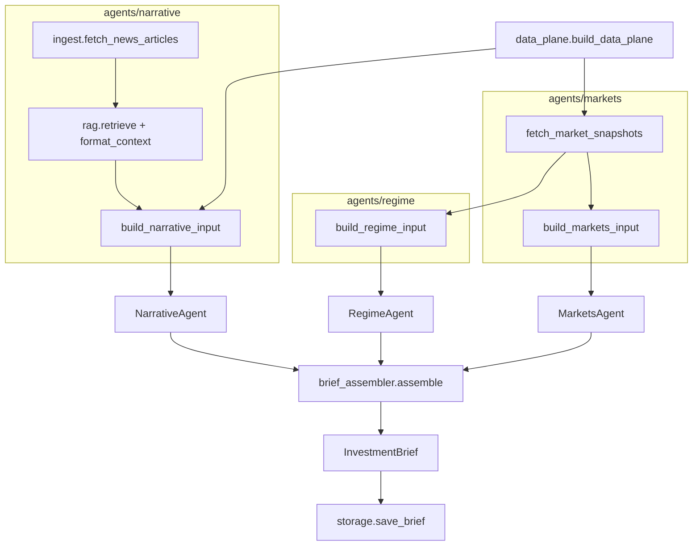
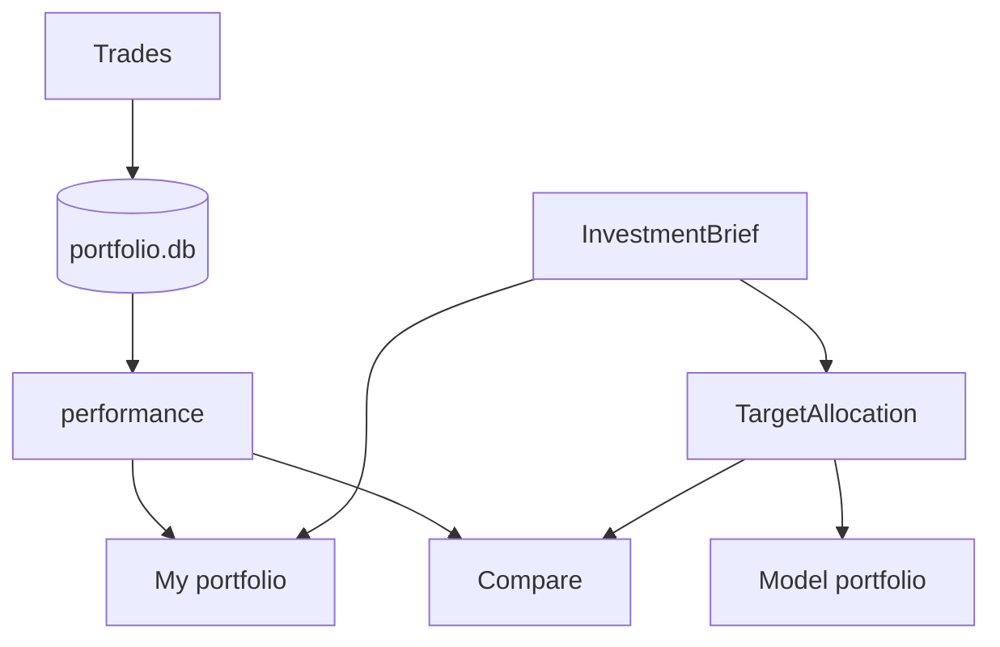

# Investment Agent — Multi-Agent Theme Analysis (v2)

**[Latest investment brief](./brief/latest.md)** · [All published reports](./brief/)

Three domain agents analyze **disjoint inputs** from a shared **Data Plane**; a programmatic **Brief Assembler** merges themes by **sector**, scores them, and ranks by **investability + consensus**. Lifecycle stages: **Early / Early-Mid / Mid / Mid-Late / Late**.

| Agent | Role | Package | External data / input |
|-------|------|---------|----------------------|
| **Regime** | Macro regime themes | `agents/regime/` | **Compact slice** of the shared yfinance snapshot: VIX, sector vol, ETF 20d / vs SPY, rule-based hints → `regime_context_block` + LLM |
| **Narrative** | Headline narrative heat | `agents/narrative/` | Finnhub (optional) + TickerTick → hybrid RAG → `context_block` + LLM (no prices) |
| **Markets** | Fundamentals + vol themes | `agents/markets/` | **Full** shared yfinance snapshot: per-symbol price/valuation/(optional) revision + vol blocks → `fundamentals` + `vol` + LLM |
| **Assembler** | Sector merge & rank | `brief_assembler.py` | Programmatic (no LLM) |

`data_plane.py` orchestrates input builders (no LLM). Regime and Markets share **one** `fetch_market_snapshots()` call — same data, different resolution (macro summary vs full fundamentals/vol). **3 LLM calls** per run. **All agent outputs in English.**

## Stage definitions

| Stage | Code | Meaning |
|-------|------|---------|
| Early | `early` | Theme forming, not fully priced — positioning |
| Early-Mid | `early_mid` | Thesis validating, narrative spreading |
| Mid | `mid` | Trend confirmed, earnings and flows supporting |
| Mid-Late | `mid_late` | Crowded, rich valuations, vol rising |
| Late | `late` | Overheated — exit watch |

## Quick start

```bash
cd investment_agent
python -m venv .venv
source .venv/bin/activate
pip install -e .

cp .env.example .env
# Set GEMINI_API_KEY or OPENAI_API_KEY (Groq / OpenRouter / OpenAI)
```

### Groq (recommended for local dev)

```bash
LLM_PROVIDER=openai
OPENAI_API_KEY=gsk_...
OPENAI_BASE_URL=https://api.groq.com/openai/v1
OPENAI_MODEL=llama-3.3-70b-versatile

MARKET_REGION=global
RESUME_CHECKPOINT=1

# Groq on-demand ~12k tokens/request — keep narrative RAG small
RAG_TOP_K=5
RAG_SUMMARY_MAX_CHARS=180
RAG_CONTEXT_MAX_CHARS=3000
NEWS_MAX_ARTICLES=25
```

Groq defaults (when vars unset): **sequential** agents, **compact JSON schema**, capped news context. After `.env` changes: **restart** Streamlit/CLI. On Narrative prompt-too-large: **Clear checkpoint** (stale `data_plane.json` may cache an oversized `context_block`).

### Gemini / OpenRouter / OpenAI

See commented blocks in `.env.example`. OpenRouter `:free` models run **sequentially** with delay by default.

```bash
python main.py              # or: invest-themes
python main.py --json
python main.py --region US
python main.py -o reports/latest.json

streamlit run streamlit_app.py   # or: invest-dashboard (Themes · Portfolio · Stock)
invest-stock AAPL                # single-stock research memo CLI
```

**Streamlit:** sidebar **View** → **Themes** | **Portfolio** | **Stock**. Themes: Run analysis · Load brief · agent tabs. Portfolio: My / Model / Compare. Stock: ticker · Run stock research · investment memo (see [Single-stock research](#single-stock-research-in-the-same-app)).

### Single-stock research (in the same app)

Same dashboard as themes (`streamlit run streamlit_app.py` → **View → Stock**). Four domain agents (Business, Financial, Valuation, Expectation) plus Reasoning produce an **Investment Memo** (`buy` / `hold` / `sell` / `watch`). `bundle.py` fetches once and slices **disjoint** context blocks; domain agents do not see each other’s reports.

| Agent | Input data (from `bundle.py` context block) |
|-------|---------------------------------------------|
| **Business** | Company profile (`longBusinessSummary`, sector/industry/country/employees/website); recent TickerTick headlines (**title + short summary**) |
| **Financial** | Key ratios from `info` (growth, margins, ROE/ROA, leverage, FCF); **annual** income/cashflow/balance key rows; **quarterly** income/cashflow/balance (up to 8 quarters) + **programmatic YoY %** |
| **Valuation** | Spot multiples (PE/PB/PS/EV-EBITDA/PEG, 52w, moving averages, beta, shares); **~5y PE/PS history percentiles** (quarterly TTM + price history); **3–5 industry/sector peer multiples** (`peers.py`) |
| **Expectation** | Analyst targets / recommendation fields; optional Finnhub recommendation trend; yfinance **earnings_estimate**, **revenue_estimate**, **earnings_history** (surprises), **earnings_dates** |
| **Reasoning** | The four domain **reports** (JSON) + ticker / company / last price — no raw yfinance re-fetch |

```bash
invest-stock AAPL
invest-stock AAPL --load          # reload last saved memo
invest-dashboard                  # unified UI (use View → Stock)
# optional standalone: streamlit run stock_research_app.py
```

Memos save under `reports/stock_research/{TICKER}_latest.json`. Checkpoint: `reports/cache/stock_research/{TICKER}/`.

### Deploy dashboard (Streamlit Community Cloud)

Share a public URL so others can open Themes without running locally. The app loads `brief/latest.json` when `reports/` is absent.

1. Push this repo to GitHub (include `brief/latest.json` — written by the weekly Action, or copy from a local `reports/latest.json`).
2. Go to [share.streamlit.io](https://share.streamlit.io/) → **New app** → select the repo → Main file: `streamlit_app.py`.
3. **Advanced settings → Secrets** (TOML). View-only works without keys; add keys only if you want **Run analysis** on Cloud:

```toml
LLM_PROVIDER = "gemini"
GEMINI_API_KEY = "your-key"
RAG_HYBRID = "0"
MARKET_REGION = "global"
```

4. Deploy and share the app URL.

Cloud tips: set `RAG_HYBRID=0` to avoid downloading sentence-transformers/torch on free instances. Portfolio SQLite on Cloud is ephemeral.

### Portfolio ledger

Record trades, view open positions, and track performance (mark-to-market via yfinance, vs SPY). The portfolio subsystem is **separate from the theme pipeline** — it reads `InvestmentBrief` for diagnostics only; it does not call LLMs or feed holdings back into agents.

- **My portfolio** (real holdings): `reports/portfolio.db` — record trades via CLI or Streamlit
- **Model portfolio**: benchmark targets and performance from the brief — **no trade entry**
- **Compare**: manual holdings vs **benchmark targets** (sector ETFs / SPY; stocks roll up by theme overlap)

```bash
invest-portfolio add-trade AAPL buy 10 175.50 --date 2026-01-15
invest-portfolio list-trades
invest-portfolio delete-trade 3
invest-portfolio list-trades --symbol AAPL
invest-portfolio positions
invest-portfolio performance
invest-portfolio performance --from 2026-01-01 --to 2026-06-30
invest-portfolio publish          # write brief/portfolio_latest.json for Streamlit Cloud
```

Or use the **Portfolio** tab in `invest-dashboard` (**My portfolio** to record trades; **Publish portfolio snapshot** button when you have trades).

**Friends on Streamlit Cloud:** `reports/portfolio.db` is not in git. After `invest-portfolio publish` and push, Cloud loads trades from `brief/portfolio_latest.json` and **mark-to-markets live** with yfinance (read-only; no trade form). Re-publish when you add/change trades.

Weighted average cost; sells exceeding holdings are rejected. Back up `reports/portfolio.db` before upgrades.

## Environment variables

| Variable | Description |
|----------|-------------|
| `LLM_PROVIDER` | `gemini` or `openai` (Groq / OpenRouter use `openai` + `OPENAI_BASE_URL`) |
| `GEMINI_API_KEY` / `GEMINI_MODEL` | Google AI Studio |
| `OPENAI_API_KEY` / `OPENAI_BASE_URL` / `OPENAI_MODEL` | OpenAI-compatible APIs |
| `MARKET_REGION` | `global`, `US`, `China`, etc. |
| `FINNHUB_API_KEY` | Optional Narrative headlines ([Finnhub](https://finnhub.io/)) |
| `NEWS_MAX_ARTICLES` | Headlines ingested (Groq default **25**) |
| `RAG_TOP_K` | Articles in Narrative LLM prompt (Groq default **5**) |
| `RAG_HYBRID` | `1` = lexical + local embeddings (RRF); `0` = lexical only |
| `RAG_EMBEDDING_MODEL` | sentence-transformers model (default `all-MiniLM-L6-v2`) |
| `RAG_RRF_K` | RRF constant (default **60**) |
| `RAG_SUMMARY_MAX_CHARS` | Per-article summary cap (Groq default **180**) |
| `RAG_CONTEXT_MAX_CHARS` | Total narrative context cap (Groq default **3000**) |
| `FUNDAMENTALS_MAX_TICKERS` | Max extra tickers for Markets (default `8`) |
| `RESUME_CHECKPOINT` | Checkpoint under `reports/cache/` (default `1`) |
| `LLM_PARALLEL_AGENTS` | `1` = parallel LLM; Groq / OpenRouter `:free` default **off** |
| `LLM_AGENT_DELAY_SECONDS` | Delay between sequential calls (OpenRouter `:free`) |
| `LLM_COMPACT_SCHEMA` | `1` = smaller JSON schema in LLM system prompt |
| `LLM_MAX_RETRIES_ON_429` | Rate-limit retries in `llm.py` |
| `PORTFOLIO_DB_PATH` | Manual portfolio SQLite (default `reports/portfolio.db`) |

Provider-aware defaults: `config.py` (`is_groq`, `is_openrouter_free`).

## Scheduled runs (GitHub Actions)

Workflow: [`.github/workflows/weekly-brief.yml`](.github/workflows/weekly-brief.yml)

- **Schedule:** every Monday 06:00 UTC (`workflow_dispatch` for manual runs)
- **Output:** committed **[`brief/latest.md`](./brief/latest.md)** (readable on GitHub) + JSON artifact (`reports/latest.json`, 90 days) for the dashboard

### Setup

1. Push this repo to GitHub.
2. **Settings → Secrets and variables → Actions** — add at minimum:
   - `GEMINI_API_KEY` (Gemini), **or** `OPENAI_API_KEY` alone:
     - `gsk_...` → Groq (auto-detects `api.groq.com` + `llama-3.3-70b-versatile`)
     - `sk-or-...` → OpenRouter (auto-detects base URL + free Llama model)
     - other `sk-...` → OpenAI (`gpt-4o` unless `OPENAI_MODEL` secret is set)
   - Override with optional `OPENAI_BASE_URL` / `OPENAI_MODEL` secrets if needed.
3. Optional: `FINNHUB_API_KEY`, `MARKET_REGION`, RAG caps (see `.env.example`).
4. **Actions → Weekly theme brief → Run workflow** to test before Monday.
5. Open **[brief/latest.md](./brief/latest.md)** on GitHub after a successful run.

Download JSON artifacts from the completed run page for `invest-dashboard` → **Load last result**.

## Architecture



### Runtime pipeline (`orchestrator.py`)

```
build_data_plane()                         no LLM
  ├─ markets/input.fetch_market_snapshots  → MarketSnapshots (yfinance, once)
  ├─ regime/input.build_regime_input       → RegimeInput (summary slice)
  ├─ narrative/input.build_narrative_input → NarrativeInput (ingest + RAG)
  └─ markets/input.build_markets_input     → MarketsInput (full snapshots)

RegimeAgent.analyze(RegimeInput)           LLM → RegimeReport
NarrativeAgent.analyze(NarrativeInput)     LLM → NarrativeReport    } parallel or sequential*
MarketsAgent.analyze(MarketsInput)         LLM → MarketsReport

brief_assembler.assemble()                 sector merge, scores, rank → themes[]
orchestrator._enrich_brief()               dates, data_sources, agent theme snapshots
```

\* **Groq** and **OpenRouter `:free`**: sequential by default (`config.llm_parallel_agents`).

**Checkpoint** (`checkpoint.py`, version **6**): `data_plane`, `regime`, `narrative`, `markets` under `reports/cache/`. On resume, narrative context is **re-truncated** to current `RAG_*` limits.

Agents never receive other agents' `*Report` objects. Inputs are **pairwise disjoint**.

## Package layout (runtime)

Each agent is a **folder** with a clear split: **data prep** vs **LLM**.

```
src/investment_agent/
├── data_plane.py              # build_data_plane(); wires all *Input builders
├── orchestrator.py            # ThemeOrchestrator.run()
├── brief_assembler.py         # sector merge, scoring, rank
├── checkpoint.py              # PIPELINE_VERSION=6
├── llm.py                     # structured JSON; 429 / 413 handling
├── models.py                  # *Report, FinalTheme, InvestmentBrief
├── storage.py                 # save/load brief; normalize_brief_dict()
├── config.py                  # Settings.from_env()
├── dates.py
├── cli.py
├── universe/                  # shared sector ETF registry (Markets, Regime, BriefAssembler)
│   ├── constants.py           # SECTOR_ETFS, TICKER_TO_SECTOR, VOL_SECTOR_LABELS
│   └── symbols.py             # symbols_for_fundamentals, vol_labeled_symbols
├── agents/
│   ├── regime/
│   │   ├── agent.py           # RegimeAgent — LLM only
│   │   └── input.py           # RegimeInput, build_regime_input() from MarketSnapshots
│   ├── narrative/
│   │   ├── ingest.py          # HTTP fetch: Finnhub + TickerTick → NewsArticle[]
│   │   ├── rag.py             # lexical retrieve + truncate → context_block
│   │   ├── input.py           # build_narrative_input() → NarrativeInput
│   │   └── agent.py           # NarrativeAgent — LLM only (reads context_block)
│   └── markets/
│       ├── input.py           # fetch_market_snapshots(), build_markets_input()
│       ├── snapshot.py        # FundamentalsSnapshot, VolSnapshot, yfinance fetch
│       ├── price.py           # PriceMetrics
│       ├── valuation.py       # ValuationMetrics
│       ├── revisions.py       # optional Finnhub revision lines
│       └── agent.py           # MarketsAgent — LLM only
└── portfolio/                 # trade ledger, performance, brief alignment (no LLM)
    ├── db.py, ledger.py, performance.py, quotes.py, cli.py
    ├── manual/                # real holdings + theme alignment
    ├── model/                 # benchmark target performance (no Streamlit trades)
    └── compare/               # manual vs benchmark drift
```

### Why Narrative has `ingest` + `rag` + `input`

| Module | Responsibility | LLM? |
|--------|----------------|------|
| **`ingest.py`** | Pull raw headlines from external APIs, dedupe, cap corpus | No |
| **`rag.py`** | Build retrieval query, score articles by keywords, format truncated `context_block` | No |
| **`input.py`** | Orchestrate ingest + RAG into frozen `NarrativeInput` for checkpoint/resume | No |
| **`agent.py`** | Single LLM call: headlines → `NarrativeReport` + themes + citations | Yes |

This matches the project rule: **fetch and slice before any LLM**; Narrative never calls `httpx` inside `agent.py`.

### Markets vs Regime (shared yfinance)

| | Markets | Regime |
|---|---------|--------|
| **Fetch** | `fetch_market_snapshots()` in `markets/input.py` | Reuses same `MarketSnapshots` |
| **Slice** | Full `fundamentals` + `vol` prompt blocks | Compact `regime_context_block` in `regime/input.py` |
| **LLM lens** | Fundamentals themes + vol themes | Macro regime themes |

### Brief assembler

1. **Collect** all `AgentTheme` rows from three reports (Markets contributes fundamentals + vol lists).
2. **Cluster by sector** — one `FinalTheme` per sector when title/ticker maps to financials, tech, energy, etc.; non-sector themes cluster by title similarity.
3. **Score each cluster:**
   - **Investability** = mean of `confidence` across themes in the cluster (0–1, from each agent's LLM output).
   - **Consensus** = `min(1.0, distinct_agents / 3)` — how many of Regime / Narrative / Markets contributed (not stage agreement).
4. **Rank** `themes[]` by `investability_score + consensus_score` (desc), keep top **8**.
5. **Display** normalized sector name (e.g. `Financials`, `Tech`).

### `InvestmentBrief` fields

| Field | Source |
|-------|--------|
| `regime_view`, `regime_themes` | `RegimeReport` |
| `narrative_view`, `narrative_themes`, `narrative_citations` | `NarrativeReport` |
| `markets_fundamentals_view`, `markets_vol_view`, `markets_themes` | `MarketsReport` |
| `themes[]` | Merged `FinalTheme` (sector-deduped, scored, ranked) |
| `fundamentals_notes` | `FundamentalsSnapshot.summary_lines()` |

Legacy theme display fields (`name_zh`, `stage_label_zh`) normalize on load via `storage.normalize_brief_dict()`.

## Portfolio architecture

The portfolio subsystem lives under `portfolio/`. **Trades** use the manual SQLite ledger; **model** and **compare** read `InvestmentBrief` only (no trade form on Model portfolio).

**Rules:** no LLM calls; no import of `ThemeOrchestrator` / `llm.py`; brief is **read-only** input for alignment and target weights. All outputs are **diagnostic** — not rebalance or trade suggestions.

### Ledger

| | Path | Where |
|---|------|--------|
| Manual trades & positions | `reports/portfolio.db` | **My portfolio**, `invest-portfolio` CLI |

Override: `PORTFOLIO_DB_PATH`.

### Dashboard views

| View | Package | What it shows |
|------|---------|----------------|
| **My portfolio** | `portfolio/manual/` | **Record trades**, positions, P&L vs SPY, research alignment |
| **Model portfolio** | `portfolio/model/` | Score-weighted benchmark targets (sector ETFs / SPY), indexed performance vs SPY |
| **Compare** | `portfolio/compare/` | Manual holdings rolled up to ETFs vs same benchmark targets |

### Data flow

Two paths — **ledger** (your trades) and **brief overlay** (research targets). They do not call the theme pipeline or LLMs; Streamlit joins them per view.

**Ledger path**

```
Trade form / invest-portfolio CLI  (My portfolio only)
  → db.py (SQLite: portfolio.db)
  → ledger.py (positions, weighted-average cost)
  → performance.py + quotes.py (yfinance marks, vs SPY chart)
```

**Brief overlay** (read-only)

```
InvestmentBrief.themes[]
  → allocation.py (benchmark mode)
  → TargetAllocation (score-weighted sector ETFs / SPY)
       ├─ manual/theme_alignment.py   — theme ↔ holding overlap
       ├─ model/target_performance.py — buy-and-hold index vs SPY
       └─ compare/drift.py            — manual holdings rolled up to ETFs
```

**Per view**

| View | Ledger | Brief modules | What you see |
|------|--------|---------------|--------------|
| **My portfolio** | `manual` | `theme_alignment` | Trades, positions, P&L vs SPY, research alignment |
| **Model portfolio** | — | `allocation`, `target_performance` | Benchmark weights, target performance vs SPY |
| **Compare** | `manual` | `allocation`, `drift` | Manual holdings vs benchmark targets (stocks mapped to sector ETFs) |



### Package layout

```
portfolio/
├── db.py, ledger.py, performance.py, quotes.py, models.py, cli.py   # shared core
├── ledger_streamlit.py, ledger_streamlit_charts.py                  # shared Streamlit UI
├── manual/
│   ├── theme_alignment.py    # top themes vs open positions (diagnostic)
│   └── views.py              # My portfolio
├── model/
│   ├── allocation.py         # compute_model_target_allocation() — ETFs / SPY only
│   ├── target_performance.py # indexed model portfolio vs SPY
│   ├── target_views.py       # performance + benchmark weights UI
│   └── views.py
└── compare/
    ├── allocation.py         # score-weighted targets (tickers | benchmark modes)
    ├── drift.py              # symbol drift + benchmark rollup drift
    ├── service.py            # evaluate_manual_vs_target()
    └── views.py
```

### Benchmark target allocation

Used by **Model portfolio** and **Compare** (not single-stock weights):

1. Take top **8** themes by `theme_rank_score`.
2. Assign each theme **one** sector ETF from theme name / sector labels (`XLK`, `XLE`, …) or **SPY** when sector is unknown.
3. Normalize theme weights to 100%; merge duplicate ETFs.
4. **Compare actual %:** direct ETF holdings + single stocks rolled into the ETF of their highest-ranked matching brief theme; unmatched holdings reported as *unmapped*.

### Performance

- **My portfolio:** `summarize_performance(ledger="manual")` — NAV, P&L, vs SPY chart from recorded trades.
- **Model portfolio:** `target_allocation_performance_series()` — buy-and-hold at benchmark weights from brief `as_of`; no trades.

Further design notes: `research/portfolio-manual-vs-ai-separation.md`, `research/portfolio-ledger-design.md`.

## Data sources

### Narrative ingest

| Provider | Auth | Module |
|----------|------|--------|
| [Finnhub](https://finnhub.io/) | `FINNHUB_API_KEY` (optional) | `agents/narrative/ingest.py` |
| [TickerTick](https://github.com/hczhu/TickerTick-API) | None | `agents/narrative/ingest.py` |

Corpus capped by `NEWS_MAX_ARTICLES`; `RAG_TOP_K` articles after **hybrid** retrieval (lexical + local `sentence-transformers` embeddings, RRF fusion; set `RAG_HYBRID=0` for lexical only). First run downloads the embedding model (~80MB). Summaries truncated by `RAG_SUMMARY_MAX_CHARS` / `RAG_CONTEXT_MAX_CHARS`. After enabling hybrid RAG, **clear checkpoint** if resuming an old run.

### Live market data (yfinance)

| Label | Symbol | Use |
|-------|--------|-----|
| VIX proxy | `^VIX` | Level and 20d change |
| Sectors | `XLK` `XLE` `XLV` `XLF` `AIQ` `SKYY` `XLY` `XLI` `XLU` | Fundamentals (all) |
| Vol subset | `XLK` `XLE` `XLV` `XLF` `AIQ` `SKYY` + `^VIX` | Ann. vol only |
| Benchmark | `SPY` | Relative performance |

Defined in `universe/constants.py`. Single fetch per run in `fetch_market_snapshots()`.

## LLM providers & limits

| Provider | Typical constraint | Mitigation |
|----------|-------------------|------------|
| Gemini flash-lite | ~20 req/day | Checkpoint resume, `latest.json` |
| Groq on-demand | ~12k tokens/request | Low `RAG_*`, compact schema, clear checkpoint |
| OpenRouter `:free` | ~50/day, ~20/min | Sequential agents, delay |

Errors: `QuotaExhaustedError` (429), prompt-too-large (413) — see `llm.py` hints.

## Roadmap: Portfolio management

**Implemented:** manual trade ledger; CLI (`invest-portfolio`) and Streamlit **Portfolio** tab (My / Model / Compare); mark-to-market P&L and vs SPY (manual); **theme alignment**; **benchmark target allocation** and drift (model + compare); model buy-and-hold performance index. Trades are **manual only** in the dashboard.

**Planned:** rebalance suggestions, apply-to-ledger sync, optional constraints / policy store.

## Roadmap: Stock picking

**Implemented:** **single-stock research** subsystem (`stock_research/`) in the **same** Streamlit app (`streamlit_app.py` → View → **Stock**): Business · Financial · Valuation · Expectation → Reasoning → `InvestmentMemo`. CLI `invest-stock`. Separate checkpoint under `reports/cache/stock_research/`. **Not** wired into theme Regime / Narrative / Markets inputs.
Agent inputs (fetch-before-LLM via `bundle.py`):

| Agent | Input |
|-------|--------|
| **Business** | Profile + `longBusinessSummary`; TickerTick title + summary headlines |
| **Financial** | `info` ratios; annual + **quarterly** statements (≤8) with **YoY %** |
| **Valuation** | Spot multiples; **5y PE/PS percentiles**; industry/sector **peer** multiples |
| **Expectation** | Targets/recs (+ optional Finnhub); earnings/revenue **estimates**, **history**, **dates** |
| **Reasoning** | Four domain reports + last price only |

**Planned:** post-theme **stock selection** so ranked sector themes surface specific names (e.g. Financials → which banks), not only sector ETFs — candidate pools per sector, shortlist into the theme dashboard (and optionally portfolio `tickers` mode). Keep fetch-before-LLM; do not feed stock-research outputs back into theme agent inputs.

Optional design notes may live under `research/` (not required to run the pipeline).

## Tests

```bash
pip install pytest
PYTHONPATH=src python -m pytest tests/test_pipeline.py tests/test_portfolio.py -v
```

Covers: data plane wiring, regime context, sector clustering & ranking, hybrid RAG, theme alignment, benchmark allocation & drift, portfolio dual-ledger, legacy brief migration.

## Disclaimer

For research only. Not investment advice.
