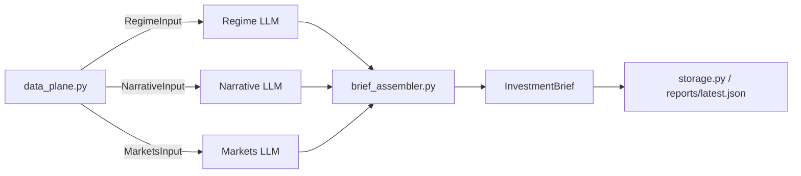

# Investment Agent — Multi-Agent Theme Analysis (v2)

Three domain agents analyze **disjoint inputs** from a shared **Data Plane**; a programmatic **Brief Assembler** merges themes with lifecycle stage: **Early / Early-Mid / Mid / Mid-Late / Late**.

| Agent | Role | Input (`data_plane.py`) | External data |
|-------|------|-------------------------|---------------|
| **Regime** | Macro regime themes | `RegimeInput` — date, region, `macro_context_block` | yfinance-derived cross-asset summary + LLM |
| **Narrative** | Headline narrative heat | `NarrativeInput` — pre-fetched RAG articles | Finnhub (optional) + TickerTick |
| **Markets** | Equity + vol themes | `MarketsInput` — fundamentals + vol snapshots | yfinance |
| **Assembler** | Cluster & rank | Three agent reports | Programmatic (`theme_key()` in `brief_assembler.py`) |

**3 LLM calls** per run (no CIO LLM). **All outputs in English.**

## Stage definitions

| Stage | Code | Meaning |
|-------|------|---------|
| Early | `early` | Theme forming, not fully priced — positioning |
| Early-Mid | `early_mid` | Thesis validating, narrative spreading |
| Mid | `mid` | Trend confirmed, earnings and flows supporting |
| Mid-Late | `mid_late` | Crowded, rich valuations, vol rising |
| Late | `late` | Overheated — exit watch |

## Quick start

```bash
cd investment_agent
python -m venv .venv
source .venv/bin/activate
pip install -e .

cp .env.example .env
# Set GEMINI_API_KEY or OPENAI_API_KEY in .env
```

### Gemini

1. Create an API key at [Google AI Studio](https://aistudio.google.com/apikey)
2. In `.env`:

```bash
LLM_PROVIDER=gemini
GEMINI_API_KEY=your-key
GEMINI_MODEL=gemini-2.5-flash-lite
```

Run:

```bash
python main.py
invest-themes

python main.py --json
python main.py --region US
python main.py -o reports/latest.json
```

### Streamlit dashboard

```bash
streamlit run streamlit_app.py
# or
invest-dashboard
```

1. Select market region, click **Run analysis**
2. Or **Load last result** for `reports/latest.json`
3. **Agent views** — three tabs: Regime · Narrative · Markets (equity + quant)
4. Expand **Independent agent themes (before merge)** — four columns (Regime, Narrative, Markets equity, Markets quant) mapped from brief snapshot fields

Merged theme cards show contributor pills and a caption with human-readable agent names (e.g. `Regime`, `Narrative`, not internal keys `macro` / `news`).

## Environment variables

| Variable | Description |
|----------|-------------|
| `GEMINI_API_KEY` | Gemini key (with `LLM_PROVIDER=gemini`) |
| `GEMINI_MODEL` | Default in code: `gemini-2.0-flash`; `.env.example` suggests `gemini-2.5-flash-lite` |
| `LLM_PROVIDER` | `gemini` or `openai` |
| `OPENAI_API_KEY` | OpenAI or compatible API key |
| `OPENAI_BASE_URL` | Optional; Gemini uses Google OpenAI-compatible endpoint by default |
| `OPENAI_MODEL` | OpenAI model id when using `LLM_PROVIDER=openai` |
| `MARKET_REGION` | `global`, `US`, `China`, etc. |
| `FINNHUB_API_KEY` | Optional; more news via [Finnhub](https://finnhub.io/) |
| `NEWS_MAX_ARTICLES` | Max headlines ingested in Data Plane (default `40`) |
| `RAG_TOP_K` | Articles passed to Narrative agent after retrieval (default `12`) |
| `FUNDAMENTALS_MAX_TICKERS` | Max extra theme tickers for fundamentals (default `8`) |
| `RESUME_CHECKPOINT` | Save steps under `reports/cache/` for resume (default `1`) |
| `LLM_MAX_RETRIES_ON_429` | Short rate-limit retries in `llm.py` (default `2`) |

## Architecture



### Runtime pipeline (`orchestrator.py`)

```
build_data_plane()           Finnhub, TickerTick, yfinance — no LLM
  ├─ RegimeInput    (macro_context_block from vol + ETF snapshot)
  ├─ NarrativeInput (news RAG context)
  └─ MarketsInput   (full fundamentals + vol blocks)

RegimeAgent.analyze()        LLM → RegimeReport          ∥ parallel
NarrativeAgent.analyze()     LLM → NarrativeReport      ∥ parallel
MarketsAgent.analyze()       LLM → MarketsReport        ∥ parallel

brief_assembler.assemble()   programmatic → InvestmentBrief
_enrich_brief()              dates, data_sources, theme snapshots
```

**Checkpoint steps:** `data_plane`, `regime`, `narrative`, `markets` under `reports/cache/`. Cache metadata uses **pipeline version 3** (`checkpoint.py`); mismatched or older caches are cleared on resume.

Agents do **not** receive other agents' reports. Inputs are **pairwise disjoint** (Regime gets a derived summary, not raw news or full Markets prompt blocks).

### Brief / UI compatibility

`InvestmentBrief` JSON still uses legacy snapshot field names for the UI:

| Brief field | v2 source | UI label |
|-------------|-----------|----------|
| `macro_view`, `macro_themes` | `RegimeReport` | Regime |
| `news_view`, `news_themes` | `NarrativeReport` | Narrative |
| `equity_view`, `equity_themes` | `MarketsReport.equity_*` | Markets (equity) |
| `quant_view`, `quant_themes` | `MarketsReport.quant_*` | Markets (quant) |

Merged `FinalTheme.contributing_agents` / `primary_agent` store internal keys (`macro`, `news`, `equity`, `quant`); Streamlit maps them to display names.

### Repository layout

```
investment_agent/
├── main.py                      # CLI shim → cli.main
├── streamlit_app.py             # Streamlit UI
├── tests/test_pipeline.py
├── reports/
│   ├── latest.json              # last saved brief (runtime)
│   └── cache/                   # checkpoint steps (runtime)
└── src/investment_agent/
    ├── orchestrator.py          # ThemeOrchestrator.run()
    ├── data_plane.py            # *Input types, build_data_plane(), Regime context
    ├── brief_assembler.py       # assemble() + theme_key()
    ├── agents/
    │   ├── regime_agent.py
    │   ├── narrative_agent.py
    │   └── markets_agent.py
    ├── news/
    │   ├── ingest.py            # Finnhub + TickerTick
    │   └── rag.py               # lexical retrieval
    ├── data/
    │   ├── snapshot.py          # FundamentalsSnapshot, VolSnapshot, fetch_*
    │   ├── price.py, valuation.py, revisions.py, universe.py
    ├── checkpoint.py
    ├── llm.py                   # LLMClient + QuotaExhaustedError
    ├── models.py                # Pydantic schemas
    ├── storage.py               # save/load brief, migrate_brief_dict, UI accessors
    ├── config.py
    ├── dates.py
    └── cli.py                   # invest-themes + invest-dashboard entry
```

Console scripts (`pyproject.toml`): `invest-themes` → `cli.main`, `invest-dashboard` → `cli.dashboard_main`.

## Data sources

| Output | Source | Notes |
|--------|--------|-------|
| `report_date`, `as_of_context` | Local clock | `dates.py` + `_enrich_brief()` |
| Regime themes, `macro_backdrop`, `dominant_regime` | LLM + **cross-asset context** | `_build_regime_context_block()` in `data_plane.py` |
| Narrative themes, citations, sourced drivers/risks | Data Plane + LLM | `news/ingest.py`, `news/rag.py` |
| Markets themes, equity/quant views | LLM + yfinance | `FundamentalsSnapshot`, `VolSnapshot` prompt blocks |
| `fundamentals_notes` | Program | `FundamentalsSnapshot.summary_lines()` |
| Final `themes[]`, scores, `contributing_agents` | `brief_assembler.py` | `theme_key()` clustering; mean confidence → `investability_score` |
| `key_drivers_sourced` / `risks_sourced` on final themes | Program | Attached when cluster includes narrative themes (token overlap) |
| `data_sources` | Program | Auto-filled in `_enrich_brief()` |

### Regime cross-asset context

Built once in Data Plane from the same yfinance fetch as Markets, but only a **compact derived block** is passed to Regime:

- VIX level and 20d change
- Sector 20d annualized vol (XLK, XLE, XLV, XLF, IGV)
- ETF 20d returns and vs-SPY spreads
- Rule-based `signals` from the fundamentals snapshot

No news text; no full per-symbol Markets prompt.

### News ingest (free tier)

| Provider | Auth | Endpoint |
|----------|------|----------|
| [Finnhub](https://finnhub.io/) | `FINNHUB_API_KEY` (optional) | `GET /api/v1/news?category=general` |
| [TickerTick](https://github.com/hczhu/TickerTick-API) | None | `GET api.tickertick.com/feed?q=T:curated` |

Without Finnhub, TickerTick alone still powers the news corpus.

### Live market data (yfinance)

Fetched in `data/snapshot.py` (`fetch_fundamentals_snapshot`, `fetch_vol_snapshot`):

| Label | Symbol | Use |
|-------|--------|-----|
| VIX proxy | `^VIX` | Level and 20-day change |
| Tech / Energy / Healthcare / Financials / AI-Cloud | `XLK` `XLE` `XLV` `XLF` `IGV` | Sector vol + fundamentals universe |
| Benchmark | `SPY` | Relative performance |

Sector ETF universe is fixed (empty theme list passed to fundamentals fetch); optional extra tickers capped by `FUNDAMENTALS_MAX_TICKERS`.

### Gemini free-tier quota (429)

A full run uses **3 LLM requests**. `gemini-2.5-flash-lite` free tier is often **~20 requests/day** (~6 full runs).

On `429 RESOURCE_EXHAUSTED`:

1. Wait for quota reset (UTC) or switch API key / `LLM_PROVIDER`
2. **Load last result** from `reports/latest.json`
3. Enable **Resume from checkpoint** — partial progress under `reports/cache/`

`QuotaExhaustedError` and retry logic are in `llm.py`.

## Tests

```bash
pip install pytest   # optional
PYTHONPATH=src python -m pytest tests/test_pipeline.py -v
```

Covers Regime context in Data Plane, `RegimeInput` field isolation, and `brief_assembler.assemble()` clustering.

## Disclaimer

Output is for research only. Not investment advice.
