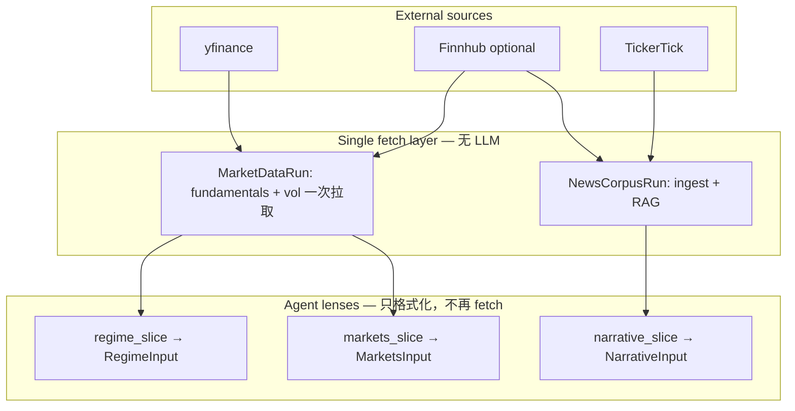

# Data ↔ Agent 关系梳理与更改建议

> 基于当前 live code（v2 三 Agent + `data_plane.py`）。只描述问题与建议，不隐含必须全部实施。

## 现状：为什么感觉「乱」

### 1. 命名与边界不一致

| 路径 | 实际职责 | 容易误解为 |
|------|----------|------------|
| `data/` | yfinance（+ 可选 Finnhub revision）→ fundamentals / vol | 「所有 Agent 的外部数据」 |
| `news/` | Finnhub + TickerTick → Narrative RAG | 与 `data/` 平级，但不在 `data/` 里 |
| `data_plane.py` | 拉数 + **切片** + `*Input` 类型 + `build_data_plane()` | 仅「数据层」 |

Narrative 的 input 在 `news/`，Regime/Markets 在 `data/`，但三者类型都定义在 `data_plane.py`——**按文件夹找 Agent 数据会对不上**。

### 2. 同一份 yfinance，两条切片路径不对称

```
fetch_fundamentals_snapshot + fetch_vol_snapshot  (data/snapshot.py)
         │
         ├─► MarketsInput：完整 FundamentalsSnapshot + VolSnapshot → to_prompt_block()
         │
         └─► RegimeInput：data_plane._build_regime_context_block() 手写摘要（非 snapshot 方法）
```

- Markets 用 snapshot 自带的 `to_prompt_block()`
- Regime 用 `data_plane` 里另一段逻辑拼 markdown  
→ **同源数据、两套格式化**，读代码时要跳两个文件才能理解 Regime 到底看了什么。

### 3. 死接口与误导性参数

- `fetch_fundamentals_snapshot(themes: list[AgentTheme])` 支持从主题抽 ticker，但 `build_data_plane()` 始终传 `[]`（`data_plane.py:152`）。
- `universe.extract_tickers_from_themes` / `FUNDAMENTALS_MAX_TICKERS` 在现 pipeline 下**几乎不生效**（只有固定 sector ETF + SPY）。
- `revisions.py` 仅对「非 ETF 个股 + 有 Finnhub key」有意义；当前 universe 以 ETF 为主，revision 常出现在 notes 里但不进 prompt 实质内容。

### 4. 字段命名残留

- `RegimeInput.macro_context_block` 与 v2 `regime_*` 命名不一致（内容已是 regime lens）。

### 5. Agent 与「检查哪些 theme」不透明

- Markets **没有**预设 theme 列表；只看固定 ETF 宇宙 + LLM 自由归纳 `fundamentals_themes` / `vol_themes`。
- 与 `fetch_fundamentals_snapshot(themes)` 的 API 设计不一致，新人会以为 theme 会驱动 Markets 拉数。

---

## 当前结构（已实现 P2 包级一一对应）

```
agents/regime/     agent.py + input.py     → RegimeInput
agents/narrative/  agent.py + input.py + ingest.py + rag.py → NarrativeInput
agents/markets/    agent.py + input.py + snapshot.py + …    → MarketsInput

data_plane.py      编排：fetch_market_snapshots → 三路 build_*_input
```

Markets 负责 yfinance 拉取；Regime 从同一份 ``MarketSnapshots`` 做摘要切片（不重复请求）。



原则：

1. **Fetch 一次，Lens 多次** — yfinance 不因为 Regime/Markets 重复请求。
2. **每个 Agent 恰好一个 slice 模块/函数** — 输入边界在 slice 里写清，不在 agent 里拼。
3. **Narrative 与 Market 数据同级** — 要么都进 `data_plane/`，要么文档/包名明确 `market_data` vs `news_data`。

---

## 更改建议（按优先级）

### P1 — 只改文档与注释（低风险，1 次 PR）

**目的**：不改行为，让「谁用哪块数据」一眼可见。

| 动作 | 说明 |
|------|------|
| 各 `data/*.py` module docstring | 标明 → `MarketsInput` 全量 / `RegimeInput` 摘要（经 `data_plane`） |
| `news/__init__.py` docstring | 标明 → 仅 `NarrativeInput` |
| `data_plane.py` 顶部 | 三张 Input 与 fetch 来源对照表 |
| README 一小节 | 与本文「目标模型」图一致 |

**不做**：移动文件、改 JSON schema、改 checkpoint。

---

### P2 — 切片对称化（中风险，推荐下一步）

**目的**：Regime / Markets 从同一份 `MarketDataRun` 切片，去掉 `data_plane` 里大段 regime 拼接。

建议结构：

```
src/investment_agent/
├── data_plane/
│   ├── inputs.py          # RegimeInput, NarrativeInput, MarketsInput, DataPlaneSnapshot
│   ├── build.py           # build_data_plane() 编排
│   ├── regime_slice.py    # build_regime_context_block() 从 MarketDataRun
│   ├── markets_slice.py   # 薄封装：MarketsInput = 全量 snapshot（或 to_prompt_block 预计算）
│   └── narrative_slice.py # 调 news/，返回 NarrativeInput
├── market_data/           # 重命名自 data/（可选；或保留 data/ 仅加别名）
│   ├── fetch.py           # fetch_market_data_run() → (FundamentalsSnapshot, VolSnapshot)
│   ├── universe.py
│   ├── price.py, valuation.py, revisions.py
│   └── snapshot.py        # 类型 + to_prompt_block；去掉「equity agent」旧注释
└── news/                  # 不变，仅 narrative 使用
```

`build_data_plane()` 伪代码：

```python
fundamentals, vol = fetch_market_data_run(...)
regime_input = build_regime_input(fundamentals, vol, as_of, region)
markets_input = build_markets_input(fundamentals, vol, as_of, region)
narrative_input = build_narrative_input(settings, as_of, region)
```

**顺带**：

- `RegimeInput.macro_context_block` → `regime_context_block`（checkpoint v5 + migrate）
- 删除或实现 `fetch_fundamentals_snapshot(themes)`：
  - **删除**：若坚持 ETF-only 宇宙；
  - **实现**：从 `Settings.extra_tickers` 或静态列表拉个股，而不是从未使用的 `themes` 参数。

---

### P3 — 语义收紧（较大，按需）

| 选项 | 内容 | 适用场景 |
|------|------|----------|
| A. 配置化宇宙 | `MARKET_UNIVERSE=etf_only\|etf_plus_tickers` + env 列表 | 想让 Markets 覆盖具体个股 |
| B. Markets 双 lens 拆成两个 tag | assembler 里 `markets_fundamentals` / `markets_vol` 而非统一 `markets` | UI 要区分两路主题来源 |
| C. Narrative 迁 yfinance news | `news/` 弱化，Narrative slice 也走 market_data | 统一数据源、少维护 Finnhub/TickerTick |
| D. Agent 包内聚 | `agents/regime/input.py` 等 | 团队按 Agent 垂直开发 |

不建议 P3 与 P2 同 PR；先 P2 稳定再选 A/B/C/D。

---

## 建议实施顺序

```
P1 注释 + README（本周）
  → P2 regime_slice 抽出 + inputs 拆分（下一 PR）
  → 决定 themes[] 参数去留或接 Settings
  → 视需要 P3-A/B/C
```

## 明确「不改」也 OK 的点

- **Markets 不接收预设 theme 列表** — 与三域独立设计一致；应在文档写清，而非强行接 `themes` 参数。
- **Narrative 留在 `news/`** — 合理；只需在包级文档说明「market 数据在 `data/`，headline 数据在 `news/`」。
- **Regime 用摘要、Markets 用全量** — 设计正确；乱的是**摘要代码位置**，不是双 lens 本身。

## 验收标准（P2 完成后）

- [ ] 新人只看 `data_plane/build.py` + 三个 `*_slice.py` 能画出 Input 来源图
- [ ] `data/`（或 `market_data/`）内无「equity agent」「quant agent」旧注释
- [ ] `grep macro_context_block` 仅剩 migrate/旧 checkpoint 或为零
- [ ] `fetch_fundamentals_snapshot` 的 `themes` 参数有明确行为或已删除
- [ ] 测试覆盖：regime slice 含 VIX/ETF；markets slice 含完整 prompt 块；三者 input 字段互不重叠
